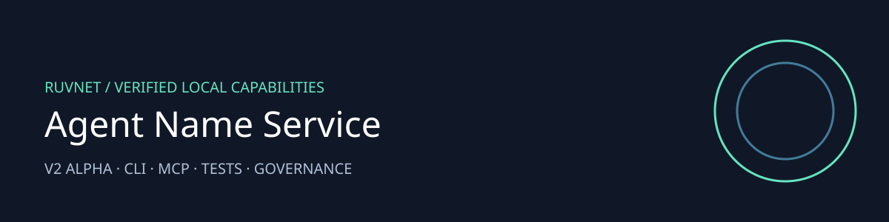

# Agent Name Service

Give an agent a verifiable name and prove who controls it.

Version 2 alpha provides a bounded local implementation with repeatable checks.

| Capability | What it does |
|---|---|
| Identity bindings | Real Ed25519 signatures with pinned issuer and expiry |
| Registry | SQLite unique names, capacity bounds, durable revocation |
| Challenge proof | Audience bound subject signatures and single use server challenges |
| Agent interface | Local CLI and SDK 2 MCP verification and policy resource |
| Validation | Tampering, expiry, replay, persistence and local benchmarks |

## Install and use

Requires Node 24 and Python 3.12 for Guardrail.

```sh
npm ci
npm test
npm run benchmark
npm ci --prefix .harness/runtime
node .harness/runtime/cli.mjs status
node .harness/runtime/cli.mjs mcp
```

[Agent tools and CLI](.harness/runtime/README.md) · [Architecture and security](docs/ADR-002-secure-local-agent.md) · [Generated MetaHarness profiles](.harness/generated/README.md)

## Scope and deployment

This is a local identity library, not X.509, DNS, a public certificate authority, or Nostr identity. Historical src/ TypeScript and sparc-agent prototypes are unsupported. The supported API is v2/identity.mjs. Production issuance requires operator managed keys, a private database directory, issuer lifecycle and incident response. MCP verification explicitly does not check a registry revocation list.

## Related projects

[RuFlo](https://github.com/ruvnet/ruflo) orchestrates agents. [MetaHarness](https://github.com/ruvnet/metaharness) provides repository harness profiles. [Autogenous](https://github.com/ruvnet/autogenous) supplies governance primitives. [RuVector](https://github.com/ruvnet/ruvector) supplies retrieval and memory. [AgentBBS](https://github.com/ruvnet/AgentBBS) and [the federation](https://x.ruv.io) support coordination. Federation observations are data and do not authorize execution. No federation membership or publication is enabled by this package.

```js
import { issue, Registry } from "./v2/identity.mjs";
// issuerPrivateKey and subjectPublicPem come from operator controlled keys.
const binding = issue({name: "worker.one", subject: subjectPublicPem, issuerPrivateKey});
const registry = new Registry("/private/ans/registry.db", binding.issuer);
registry.register(binding);
const challenge = registry.challenge("my-service");
// The subject signs challengePayload(binding.id, challenge.nonce, challenge.audience).
// registry.authenticate(binding.name, {...challenge, signature}, "my-service") consumes it.
registry.revoke(binding.id);
registry.close();
```
