# Agent Name Service (ANS) Architecture

## 1. System Overview

The Agent Name Service (ANS) provides a critical infrastructure component for agent identity management, discovery, and secure communication within the Mastra ecosystem. Similar to DNS in concept, ANS maps agent identifiers to connection endpoints and authentication information, enabling secure agent-to-agent (A2A) communication and Management Control Panel (MCP) integration.

## 2. High-Level Architecture

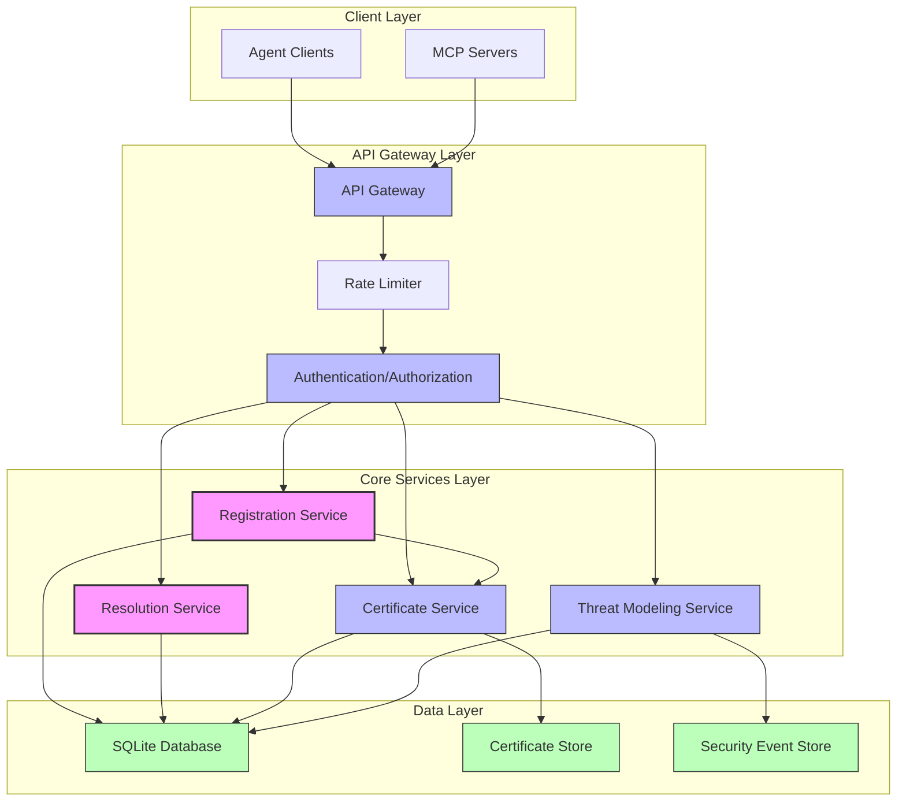

## 3. Component Architecture

### 3.1 Core Components

#### API Gateway
- **Responsibility**: Routes requests to appropriate services, handles protocol version negotiation
- **Key Functions**:
  - Request routing
  - Protocol version detection
  - Request/response formatting
  - Transport security (TLS)
  - Initial request validation

#### Registration Service
- **Responsibility**: Manages agent registration, updates, and deregistration
- **Key Functions**:
  - Process registration requests
  - Validate agent information
  - Generate unique identifiers
  - Coordinate with Certificate Service
  - Store agent records

#### Resolution Service
- **Responsibility**: Resolves agent identifiers to endpoints and certificates
- **Key Functions**:
  - Process resolution requests
  - Support capability-based queries
  - Apply access controls
  - Return complete agent information
  - Handle pagination and filtering

#### Certificate Service
- **Responsibility**: Manages the lifecycle of agent certificates
- **Key Functions**:
  - Generate X.509 certificates
  - Validate certificate requests
  - Manage certificate revocation
  - Store certificate information
  - Verify certificate chains

#### Threat Modeling Service
- **Responsibility**: Integrates with Mastra.ai for threat detection and response
- **Key Functions**:
  - Monitor for suspicious activity
  - Report security events
  - Apply threat mitigations
  - Implement adaptive security
  - Maintain security audit logs

### 3.2 Component Interaction Diagram

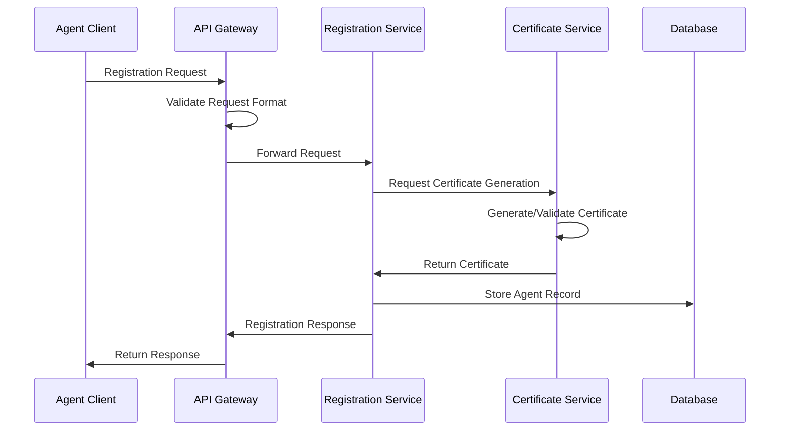

## 4. Data Flow Architecture

### 4.1 Agent Registration Flow

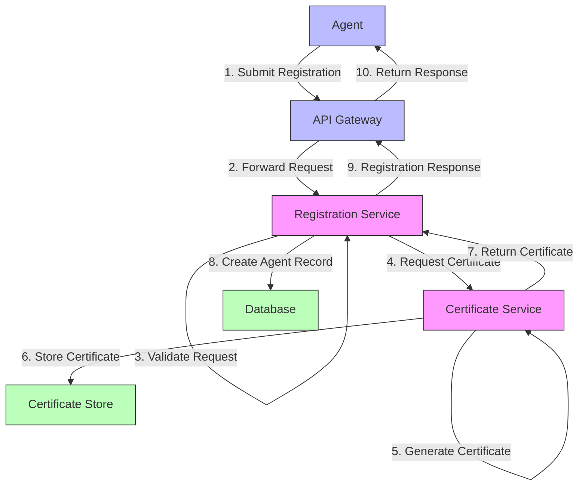

### 4.2 Agent Resolution Flow

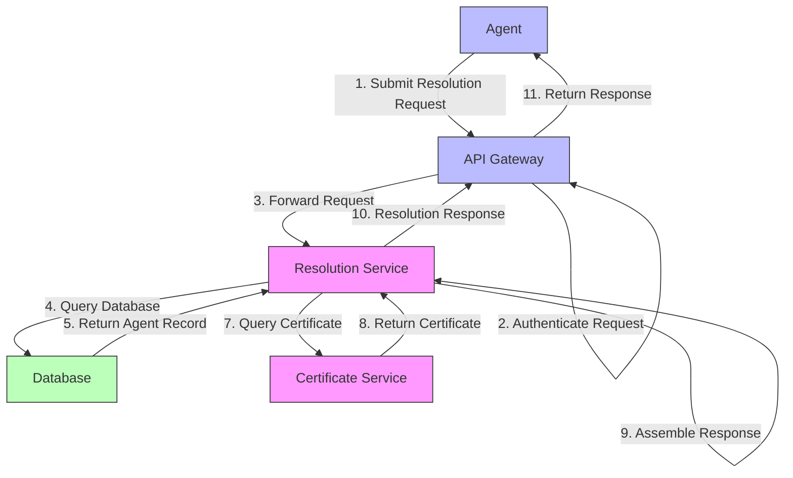

## 5. Component Interface Definitions

### 5.1 Registration Service API

| Endpoint | Method | Description | Request | Response |
|----------|--------|-------------|---------|----------|
| `/v1/agents` | POST | Register new agent | `AgentRegistrationRequest` | `AgentRegistrationResponse` |
| `/v1/agents/{id}` | PUT | Update agent | `AgentUpdateRequest` | `AgentUpdateResponse` |
| `/v1/agents/{id}` | DELETE | Deregister agent | `AgentDeregistrationRequest` | `AgentDeregistrationResponse` |
| `/v1/agents/{id}/status` | PUT | Update status | `AgentStatusUpdateRequest` | `AgentStatusUpdateResponse` |
| `/v1/agents/{id}/capabilities` | PUT | Update capabilities | `AgentCapabilitiesUpdateRequest` | `AgentCapabilitiesUpdateResponse` |

#### Interface Contracts

```typescript
// Registration Service Interfaces

interface AgentRegistrationRequest {
  name: string;
  description?: string;
  endpoints: EndpointInfo[];
  capabilities: string[];
  version: string;
  publicKey: string;
  owner: string;
}

interface EndpointInfo {
  protocol: string;
  address: string;
  port: number;
  metadata?: Record<string, any>;
}

interface AgentRegistrationResponse {
  id: string;
  name: string;
  certificate: string;
  certificateFingerprint: string;
  expiresAt: string;
}
```

### 5.2 Resolution Service API

| Endpoint | Method | Description | Request | Response |
|----------|--------|-------------|---------|----------|
| `/v1/resolve/{id}` | GET | Resolve by ID | - | `AgentResolutionResponse` |
| `/v1/resolve/query` | POST | Advanced query | `ResolutionQueryRequest` | `AgentsResolutionResponse` |
| `/v1/resolve/capabilities/{capability}` | GET | Find by capability | - | `AgentsResolutionResponse` |
| `/v1/resolve/name/{name}` | GET | Resolve by name | - | `AgentsResolutionResponse` |
| `/v1/resolve/batch` | POST | Batch resolution | `BatchResolutionRequest` | `BatchResolutionResponse` |

#### Interface Contracts

```typescript
// Resolution Service Interfaces

interface ResolutionQueryRequest {
  id?: string;
  name?: string;
  fingerprint?: string;
  capabilities?: string[];
  allCapabilities?: boolean;
  status?: string[];
  owner?: string;
  limit?: number;
  offset?: number;
  orderBy?: string;
  orderDirection?: 'asc' | 'desc';
}

interface AgentResolutionResponse {
  id: string;
  name: string;
  description?: string;
  endpoints: EndpointInfo[];
  capabilities: string[];
  version: string;
  certificateFingerprint: string;
  expiresAt: string;
}

interface AgentsResolutionResponse {
  agents: AgentResolutionResponse[];
  totalCount: number;
  offset: number;
  limit: number;
}
```

### 5.3 Certificate Service API

| Endpoint | Method | Description | Request | Response |
|----------|--------|-------------|---------|----------|
| `/v1/certificates` | POST | Create certificate | `CertificateCreationRequest` | `CertificateResponse` |
| `/v1/certificates/{id}` | GET | Get certificate | - | `CertificateResponse` |
| `/v1/certificates/{id}/status` | PUT | Update status | `CertificateStatusUpdateRequest` | `CertificateStatusUpdateResponse` |
| `/v1/certificates/validate` | POST | Validate certificate | `CertificateValidationRequest` | `CertificateValidationResponse` |
| `/v1/certificates/revoke` | POST | Revoke certificate | `CertificateRevocationRequest` | `CertificateRevocationResponse` |

#### Interface Contracts

```typescript
// Certificate Service Interfaces

interface CertificateCreationRequest {
  subject: string;
  publicKey: string;
  validityDays?: number;
  keyUsage?: string[];
  extendedKeyUsage?: string[];
}

interface CertificateResponse {
  id: string;
  subject: string;
  issuer: string;
  notBefore: string;
  notAfter: string;
  certificate: string;
  fingerprint: string;
  status: string;
}
```

### 5.4 Threat Modeling Service API

| Endpoint | Method | Description | Request | Response |
|----------|--------|-------------|---------|----------|
| `/v1/security/events` | POST | Report event | `SecurityEventRequest` | `SecurityEventResponse` |
| `/v1/security/threats` | GET | Get threats | - | `ActiveThreatsResponse` |
| `/v1/security/mitigate` | POST | Apply mitigation | `MitigationRequest` | `MitigationResponse` |
| `/v1/security/status` | GET | Get security status | - | `SecurityStatusResponse` |
| `/v1/security/scan` | POST | Request scan | `SecurityScanRequest` | `SecurityScanResponse` |

#### Interface Contracts

```typescript
// Threat Modeling Service Interfaces

interface SecurityEventRequest {
  eventType: string;
  severity: string;
  source: string;
  target: string;
  description: string;
  metadata?: Record<string, any>;
}

interface SecurityEventResponse {
  id: string;
  timestamp: string;
  eventType: string;
  severity: string;
  mitigationApplied: boolean;
  mitigationDetails?: string;
}
```

## 6. Security Architecture

### 6.1 Certificate Management Architecture

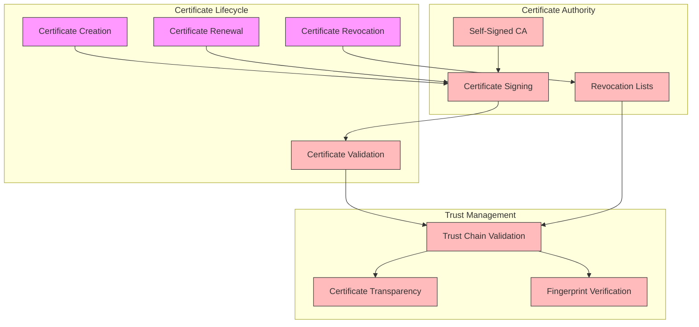

### 6.2 Authentication Flow

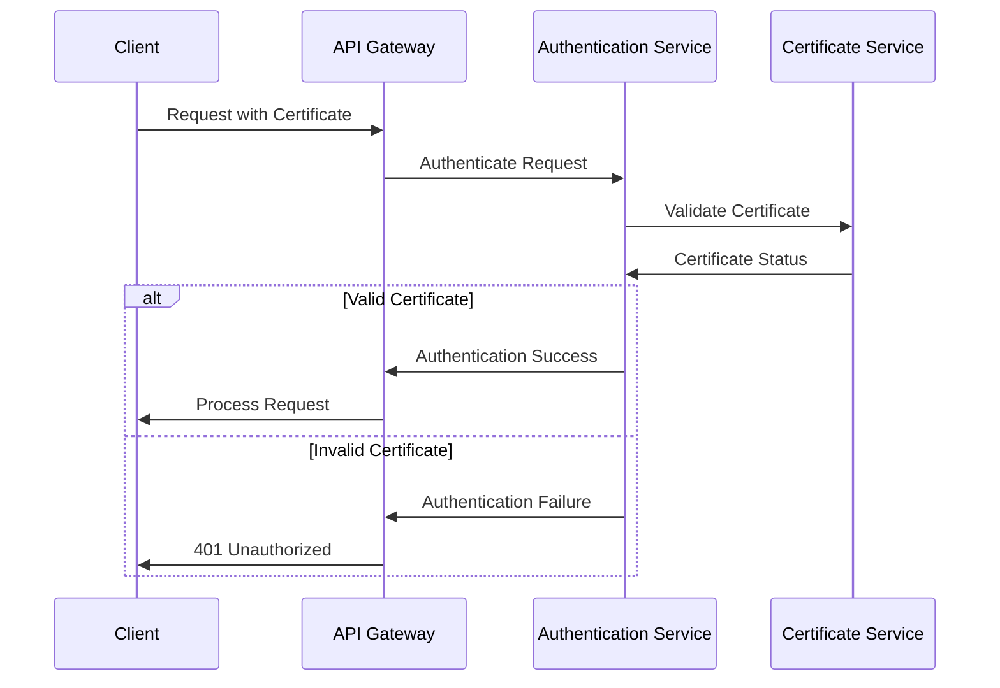

### 6.3 Threat Modeling Integration

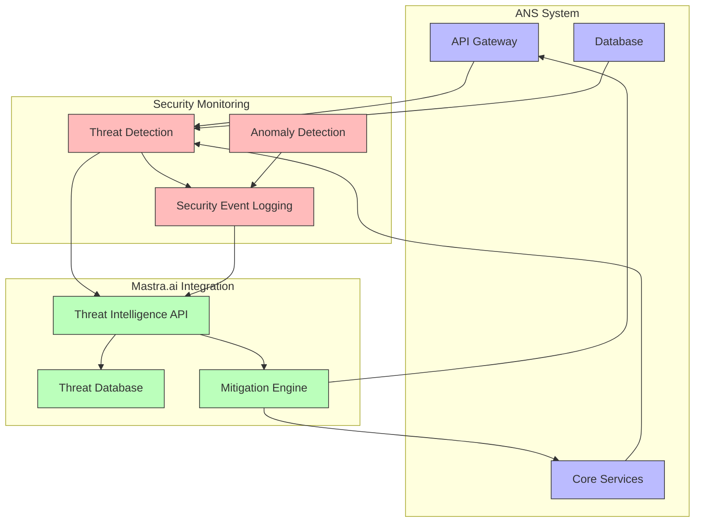

## 7. Database Schema Architecture

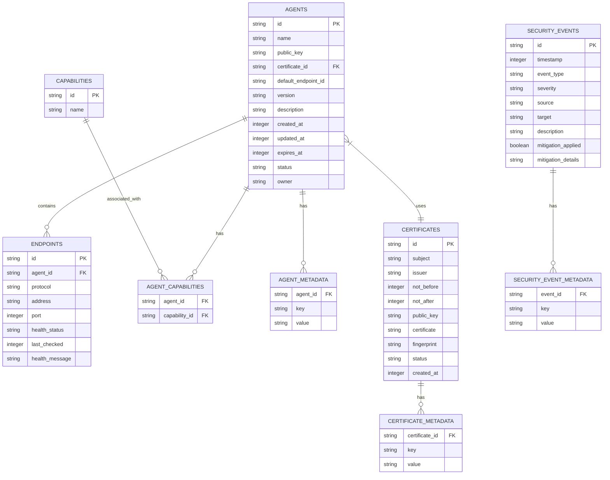

## 8. Deployment Architecture

### 8.1 Single-Node Deployment (Development/Testing)

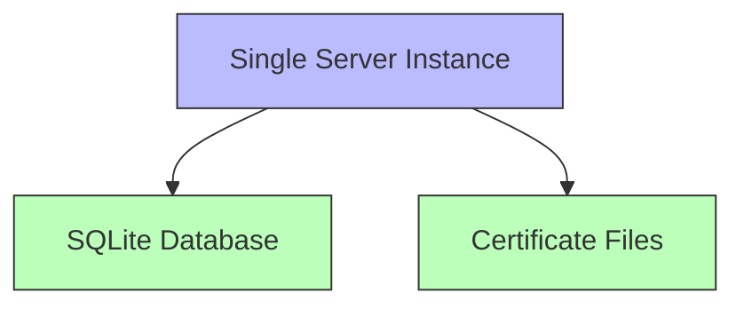

### 8.2 High-Availability Deployment (Production)

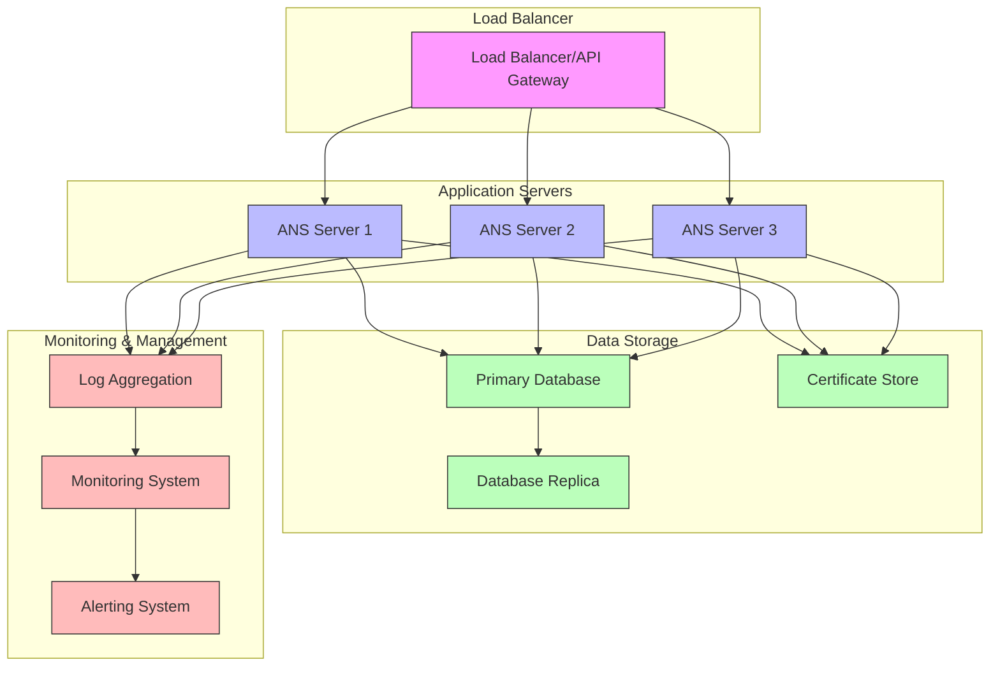

## 9. Scalability Considerations

### 9.1 Horizontal Scaling

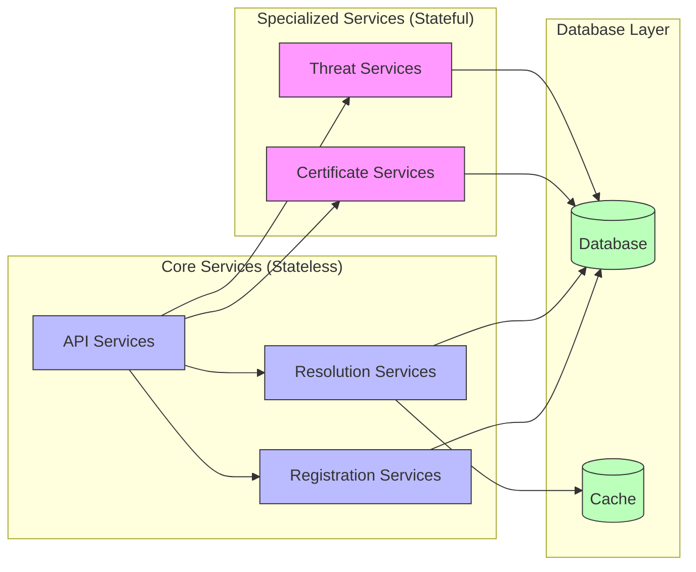

### 9.2 Performance Optimization Strategies

1. **Caching Layer**:
   - Implement multi-level caching for frequently resolved agents
   - Use in-memory cache for resolution queries
   - Cache certificate validation results

2. **Database Optimization**:
   - Indexed queries for common lookup patterns
   - Efficient query design for capability lookups
   - Connection pooling for database access

3. **Load Distribution**:
   - Read/write separation for database operations
   - Batch processing for bulk operations
   - Asynchronous processing for non-critical operations

4. **Resource Management**:
   - Graceful degradation under heavy load
   - Circuit breakers for dependent services
   - Resource throttling for abusive clients

## 10. Monitoring and Observability

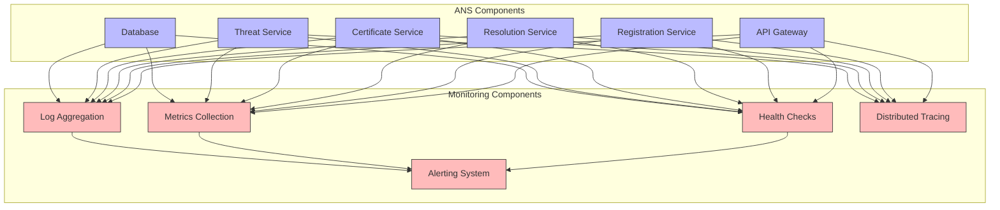

## 11. Key Design Principles

1. **Separation of Concerns**:
   - Each service has a clearly defined responsibility
   - Clean interfaces between components
   - Minimal dependencies between services

2. **Security by Design**:
   - Certificate-based authentication for all operations
   - Defense in depth with multiple security layers
   - Integration with Mastra.ai threat modeling

3. **Extensibility**:
   - Versioned API and protocol
   - Metadata extension points for future attributes
   - Pluggable components for specialized functionality

4. **Resilience**:
   - Graceful degradation during partial failures
   - Comprehensive error handling
   - Circuit breakers for dependent services

5. **Performance**:
   - Optimized data access patterns
   - Efficient protocol design
   - Caching of frequently accessed data

## 12. Implementation Roadmap

1. **Phase 1: Core Infrastructure**
   - Database schema and migrations
   - Basic API server setup
   - Protocol formatting service
   - Integration test infrastructure

2. **Phase 2: Core Services**
   - Registration service implementation
   - Resolution service implementation
   - Certificate service implementation
   - Basic security controls

3. **Phase 3: Security & Integration**
   - Mastra.ai threat modeling integration
   - Advanced certificate management
   - MCP integration endpoints
   - Comprehensive security testing

4. **Phase 4: Optimization & Scaling**
   - Performance testing and optimization
   - Distributed deployment support
   - Advanced monitoring and observability
   - Production readiness validation