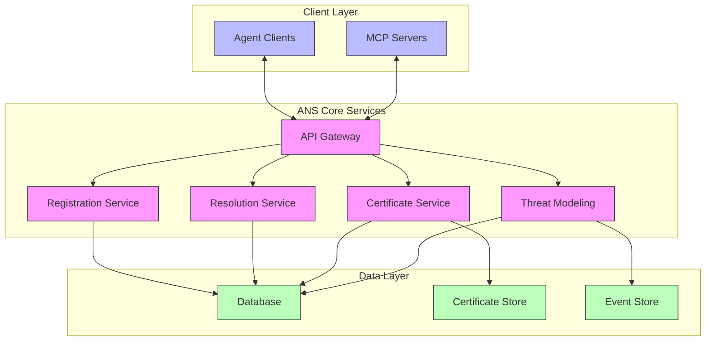
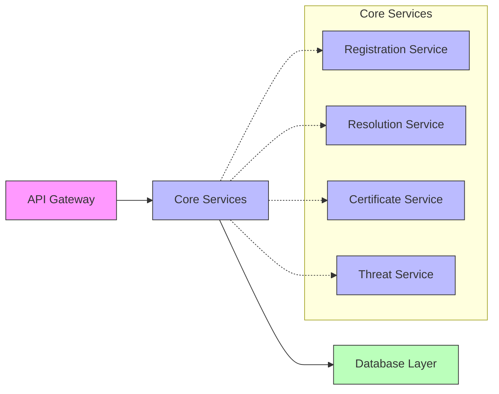
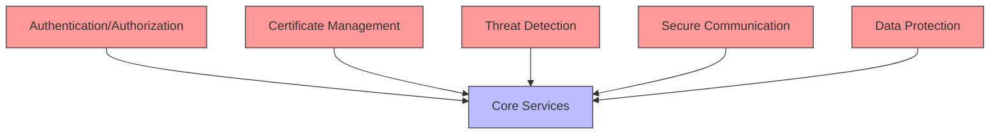
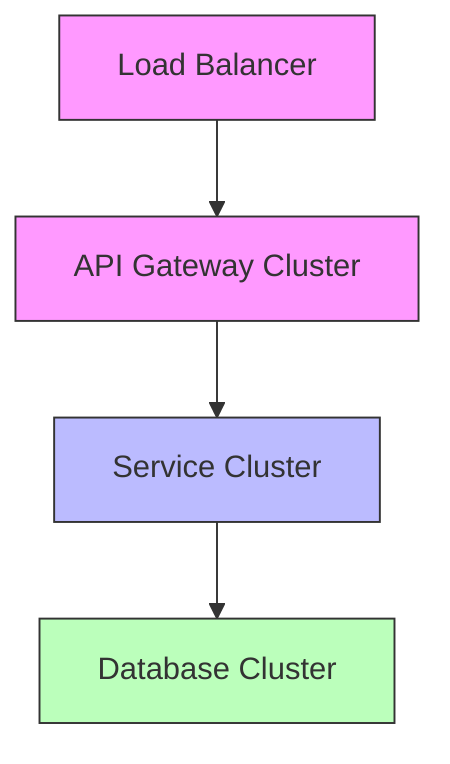
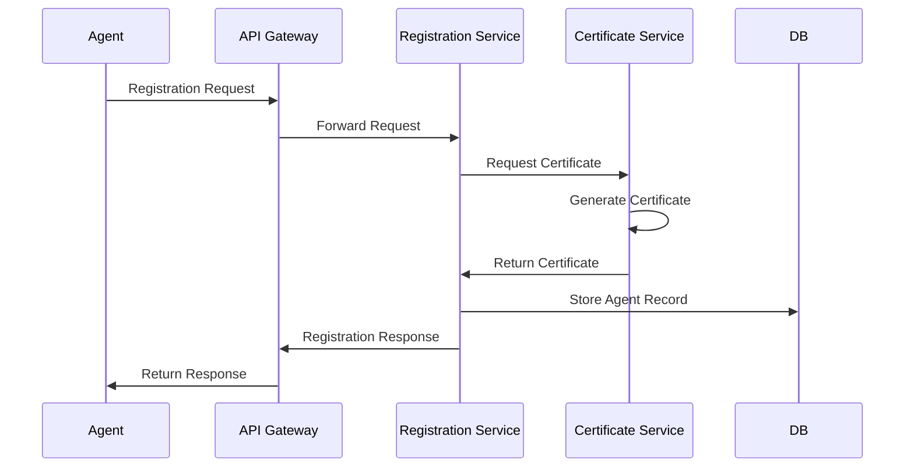
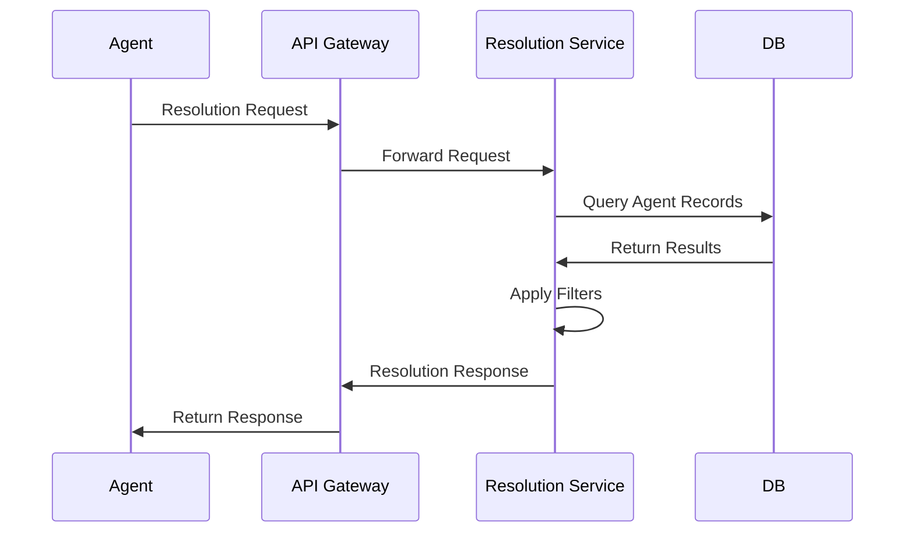
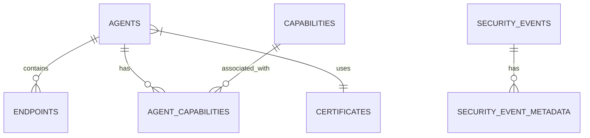

# Agent Name Service (ANS) Architecture Overview

## Introduction

The Agent Name Service (ANS) provides a critical infrastructure component enabling communication and discovery between autonomous agents and Management Control Panel (MCP) servers. This document serves as the main entry point to understand the ANS architecture and how the different architectural components fit together.

## Architecture Document Structure

The ANS architecture is documented across several specialized documents:

1. [**Main Architecture Document**](ans_architecture.md) - Core system design, components, and data flows
2. [**Deployment Guide**](ans_deployment_guide.md) - Deployment strategies and reliability considerations
3. [**Security Architecture**](ans_security_architecture.md) - Security design, certificate handling, and threat modeling

## High-Level Overview

## Key System Features

The ANS architecture implements the following key features:

### 1. Agent Registration and Identity

- Unique identifier allocation and management
- Certificate-based identity verification
- Metadata and capability declaration
- Lifecycle management (creation, updates, expiration)

### 2. Agent Resolution and Discovery

- Lookup by identifier or name
- Capability-based discovery
- Cryptographic identity verification
- Filtering and access controls

### 3. Certificate Infrastructure

- X.509 certificate generation and validation
- Certificate lifecycle management
- Trust chain validation
- Revocation support

### 4. Security and Threat Management

- Integration with Mastra.ai threat modeling
- Adaptive security controls
- Comprehensive logging and monitoring
- Rate limiting and abuse prevention

### 5. MCP Integration

- Privileged access for MCP servers
- Bulk operations support
- Enhanced administrative capabilities
- Delegated agent management

## Core Design Principles

### Modularity

The ANS architecture follows a modular design with clearly separated components:

Each component has:
- Well-defined responsibilities
- Clear interfaces
- Isolated implementation details
- Independent scalability

### Security by Design

Security is integrated into every aspect of the ANS architecture:

Security features include:
- Certificate-based authentication
- TLS for all communications
- Comprehensive access controls
- Threat detection and mitigation
- Secure development practices

### Scalability

The architecture is designed for horizontal scaling:

Scalability features include:
- Stateless service design
- Horizontal scaling of components
- Caching for read-heavy workloads
- Database optimizations
- Efficient resource utilization

## Key Workflows

### Agent Registration Flow

### Agent Resolution Flow

## Technology Stack

| Component | Technology | Reasoning |
|-----------|------------|-----------|
| Programming Language | TypeScript | Compatibility with Mastra framework |
| Database | SQLite (dev), PostgreSQL (prod) | Lightweight for development, scalable for production |
| API Protocol | RESTful with JSON | Broad interoperability |
| Authentication | X.509 Certificates | Strong identity verification |
| Transport Security | TLS 1.3+ | Strong protection for communications |
| Container Platform | Docker/Kubernetes | Industry standard orchestration |

## Implementation Considerations

### Database Schema

The core database schema encompasses these main entities:

### API Contract

The ANS exposes the following primary API endpoints:

| Area | Key Endpoints | Purpose |
|------|--------------|---------|
| Registration | `/v1/agents` | Agent registration and management |
| Resolution | `/v1/resolve` | Agent discovery and lookup |
| Certificates | `/v1/certificates` | Certificate management |
| Security | `/v1/security` | Security operations and reporting |
| MCP | `/v1/mcp` | MCP-specific operations |

## Next Steps

For detailed information on specific aspects of the architecture, refer to the specialized documents:

1. **[Main Architecture Document](ans_architecture.md)** - For detailed component design, interfaces, and data flows
2. **[Deployment Guide](ans_deployment_guide.md)** - For deployment patterns, scaling strategies, and reliability considerations
3. **[Security Architecture](ans_security_architecture.md)** - For security design, certificate handling, and threat modeling integration

## Future Enhancements

The ANS architecture is designed to evolve with future enhancements:

1. **Federation Support** - Cross-network federation capabilities
2. **Advanced Discovery** - Semantic and context-aware discovery
3. **Performance Optimization** - Advanced caching and query optimization
4. **Enhanced Security** - Hardware security modules and quantum-safe cryptography
5. **Extended Monitoring** - AI-based anomaly detection and predictive alerts