# ANS Deployment and Reliability Guide

This document provides specific guidance for deploying the Agent Name Service (ANS) in production environments, focusing on reliability, scalability, and security considerations.

## 1. Deployment Strategies

### 1.1 Environment Tiers

| Environment | Purpose | Scaling | Database |
|-------------|---------|---------|----------|
| Development | Local development and testing | Single instance | SQLite |
| Staging | Integration testing and pre-production validation | Limited horizontal scaling | SQLite (single node) |
| Production | Production workloads | Full horizontal scaling | PostgreSQL (for high-volume deployments) |

### 1.2 Containerization Strategy

The ANS system is designed to be containerized using Docker:

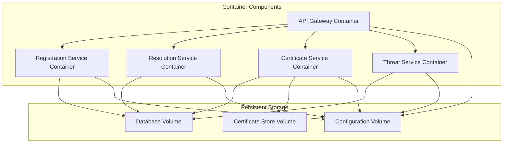

### 1.3 Container Orchestration

For production deployments, Kubernetes is recommended with the following resource configuration:

| Component | CPU Request | Memory Request | CPU Limit | Memory Limit |
|-----------|-------------|----------------|-----------|--------------|
| API Gateway | 0.5 | 512Mi | 1.0 | 1Gi |
| Registration Service | 0.5 | 512Mi | 1.0 | 1Gi |
| Resolution Service | 1.0 | 1Gi | 2.0 | 2Gi |
| Certificate Service | 0.5 | 512Mi | 1.0 | 1Gi |
| Threat Service | 0.5 | 512Mi | 1.0 | 1Gi |
| Database (SQLite) | 0.5 | 1Gi | 1.0 | 2Gi |
| Database (PostgreSQL) | 2.0 | 4Gi | 4.0 | 8Gi |

## 2. Reliability Strategies

### 2.1 High Availability Configuration

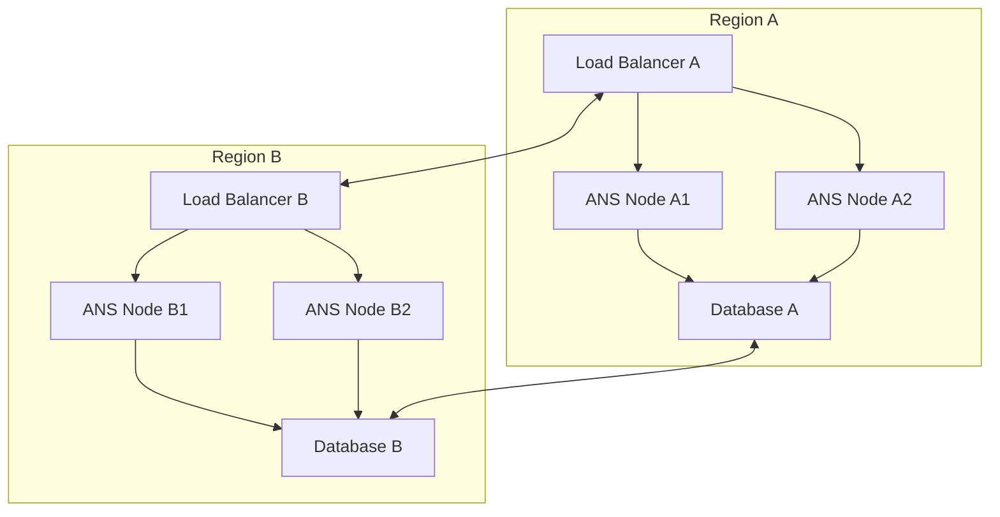

### 2.2 Failure Modes and Handling

| Failure Mode | Impact | Mitigation Strategy |
|--------------|--------|---------------------|
| Single node failure | Reduced capacity | Auto-scaling, health checks, node replacement |
| Database failure | Data access disruption | Database replication, failover mechanisms |
| Network partition | Service isolation | Multi-region deployment, circuit breakers |
| Certificate service failure | Auth disruption | Certificate caching, fallback validation |
| External API failures | Limited functionality | Circuit breakers, graceful degradation |

### 2.3 Recovery Point Objective (RPO) and Recovery Time Objective (RTO)

| Service Component | RPO | RTO |
|-------------------|-----|-----|
| Agent registration data | < 5 minutes | < 10 minutes |
| Certificate data | < 1 minute | < 5 minutes |
| Security events | < 15 minutes | < 30 minutes |

## 3. Scalability Implementation

### 3.1 Horizontal Scaling Approach

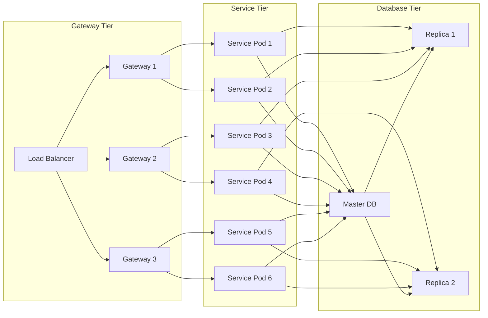

### 3.2 Auto-scaling Rules

| Component | Scale Out Trigger | Scale In Trigger | Min Instances | Max Instances |
|-----------|-------------------|------------------|---------------|---------------|
| API Gateway | CPU > 70% for 2m | CPU < 30% for 10m | 2 | 10 |
| Registration Service | Queue depth > 100 | Queue depth < 10 for 10m | 2 | 8 |
| Resolution Service | CPU > 60% for 2m | CPU < 30% for 10m | 3 | 12 |
| Certificate Service | CPU > 60% for 2m | CPU < 30% for 10m | 2 | 8 |
| Threat Service | CPU > 60% for 2m | CPU < 30% for 10m | 2 | 6 |

### 3.3 Resource Scaling Strategy

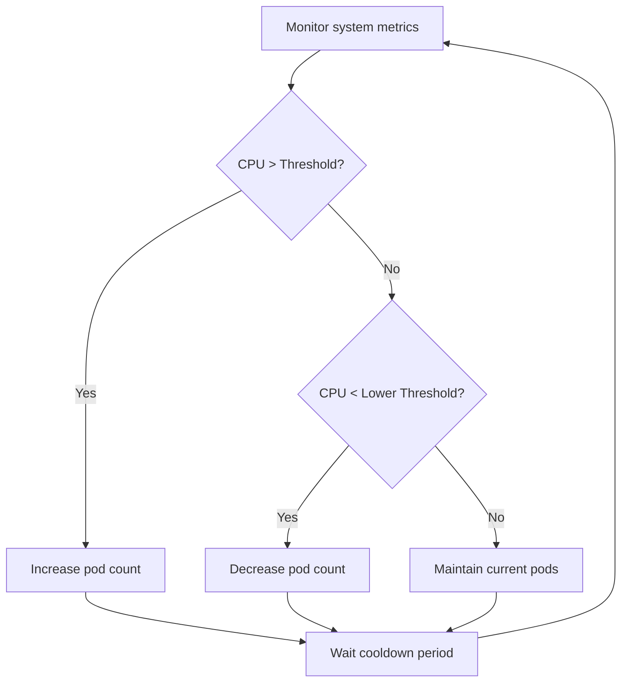

## 4. Database Scaling

### 4.1 Development to Production Migration

For production workloads exceeding the capacity of SQLite, migration to PostgreSQL is recommended:

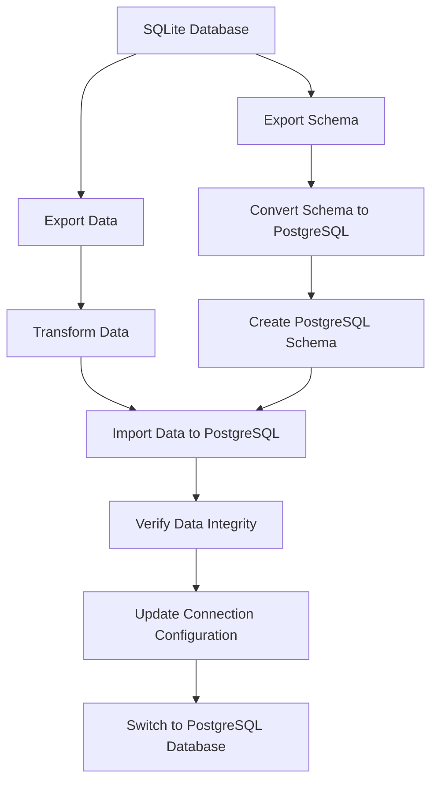

### 4.2 Read/Write Split Strategy

For high-volume deployments, implement read/write splitting:

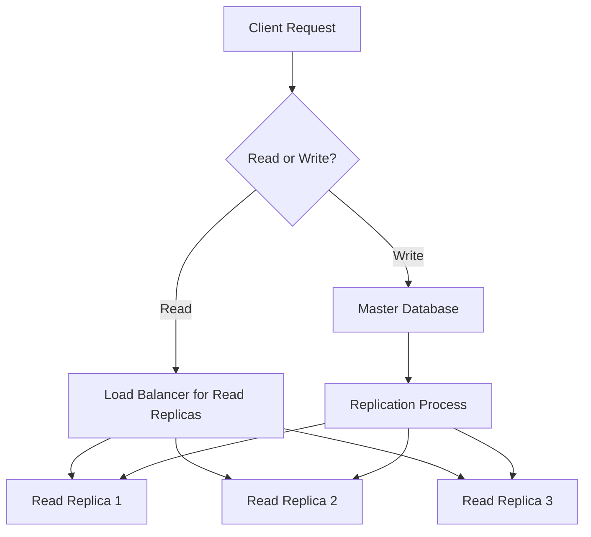

## 5. Security Hardening for Production

### 5.1 Certificate Management

For production environments, integrate with external certificate authorities:

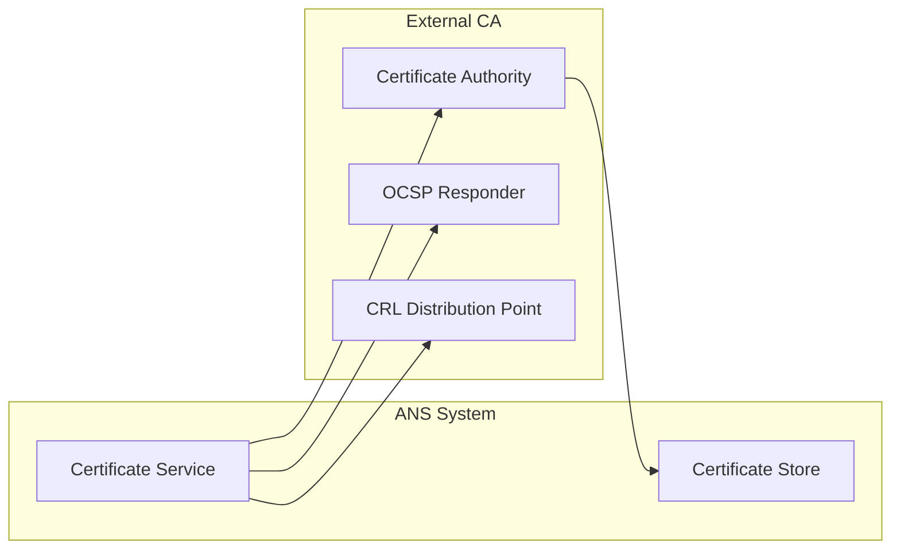

### 5.2 Network Security Implementation

| Zone | Components | Inbound Access | Outbound Access |
|------|------------|----------------|-----------------|
| Public | API Gateway | HTTPS (443) | Internal services only |
| Service | Core Services | API Gateway only | Database, External APIs |
| Data | Database | Service layer only | None |
| Management | Admin Tools | VPN/Bastion only | Monitoring systems |

### 5.3 Security Scanning Integration

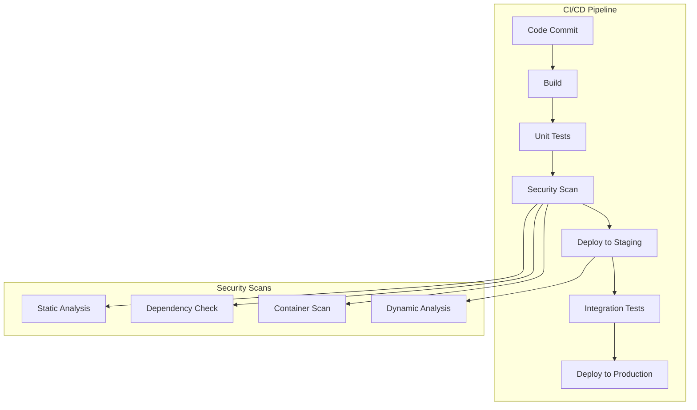

## 6. Monitoring Implementation

### 6.1 Metrics Collection

| Component | Key Metrics | Warning Threshold | Critical Threshold |
|-----------|-------------|-------------------|-------------------|
| API Gateway | Request rate, Error rate, Latency | >100 req/s, >1% errors, >100ms | >500 req/s, >5% errors, >250ms |
| Registration Service | Request rate, Processing time | >20 req/s, >200ms | >50 req/s, >500ms |
| Resolution Service | Request rate, Lookup time | >200 req/s, >50ms | >500 req/s, >100ms |
| Certificate Service | Validation rate, Issuance time | >50 req/s, >300ms | >100 req/s, >700ms |
| Database | Connections, Query time, Size | >50 conn, >50ms, >80% capacity | >100 conn, >100ms, >90% capacity |

### 6.2 Log Aggregation

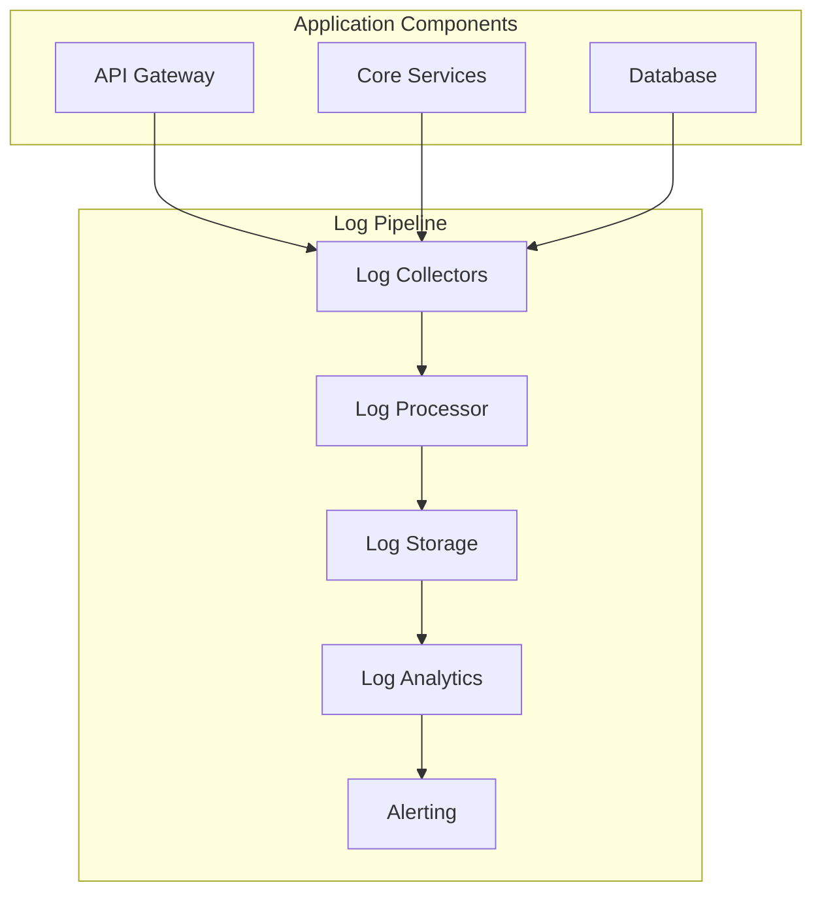

### 6.3 Health Check Implementation

| Endpoint | Check Type | Frequency | Timeout | Failure Threshold |
|----------|------------|-----------|---------|-------------------|
| `/health/liveness` | HTTP GET | 10s | 2s | 3 failures |
| `/health/readiness` | HTTP GET | 30s | 5s | 2 failures |
| `/health/startup` | HTTP GET | 5s | 10s | 12 failures |
| `/health/database` | HTTP GET | 60s | 5s | 2 failures |
| `/health/certificate` | HTTP GET | 60s | 5s | 2 failures |

## 7. Disaster Recovery Plan

### 7.1 Backup Strategy

| Data Category | Backup Frequency | Retention Period | Storage Location |
|---------------|------------------|------------------|------------------|
| Database | Hourly | 7 days | Primary + Secondary region |
| Certificate store | Daily | 90 days | Primary + Secondary region + Cold storage |
| Configuration | After changes | 365 days | Version control + Secondary region |
| Logs | Real-time | 30 days | Primary region + Archive |

### 7.2 Recovery Procedure

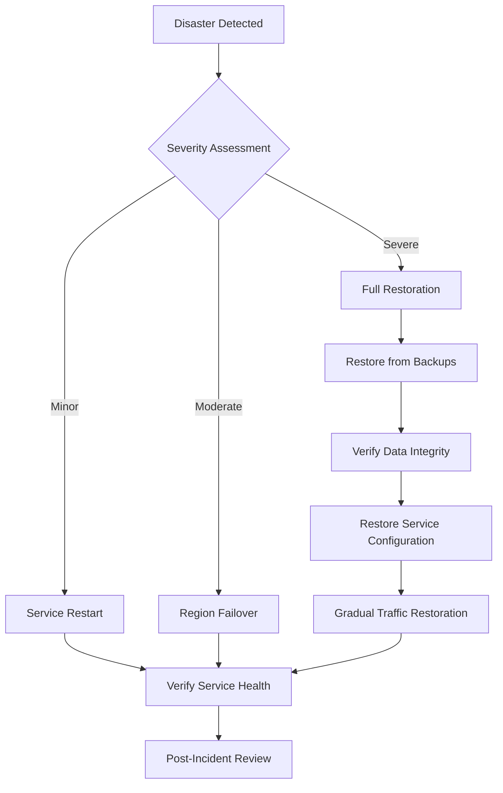

## 8. Performance Optimization

### 8.1 Database Optimization

| Strategy | Implementation | Expected Impact |
|----------|----------------|-----------------|
| Index optimization | Create indexes for common query patterns | 50-80% query time reduction |
| Connection pooling | Implement with 10-20 max connections per service | Reduced connection overhead |
| Query optimization | Rewrite complex queries using query analyzer results | 30-60% query time reduction |
| Denormalization | Create read-optimized views for resolution queries | 40-70% read time reduction |

### 8.2 Caching Strategy

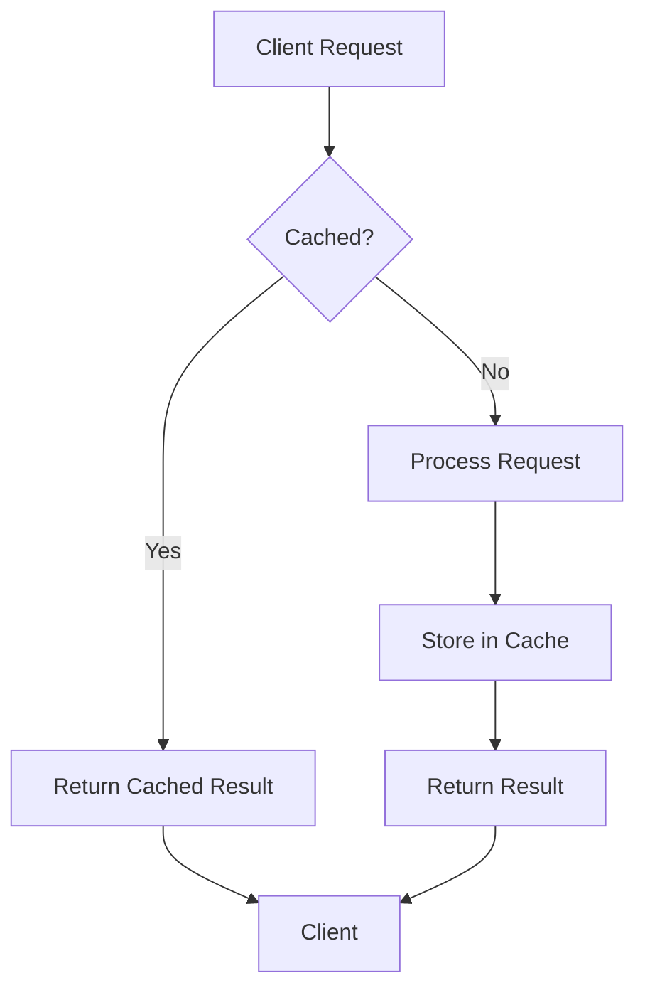

| Cache Type | Data Category | TTL | Invalidation Strategy |
|------------|---------------|-----|------------------------|
| In-memory | Resolution results | 60s | Time-based + explicit on update |
| Redis | Certificate validation | 5m | Time-based + explicit on status change |
| Local | Configuration | 5m | Configuration change events |
| CDN | Public certificates | 15m | Time-based + explicit on revocation |

## 9. Implementation Checklist

### 9.1 Pre-Deployment Validation

- [ ] Database schema creation and migration scripts tested
- [ ] Service startup sequence validated
- [ ] Network security policies implemented and tested
- [ ] Certificate issuance and validation flow verified
- [ ] API endpoints secured with proper authentication
- [ ] Rate limiting configured and tested
- [ ] Health check endpoints implemented and responding correctly
- [ ] Logging configured with appropriate levels
- [ ] Metrics collection enabled and dashboards created
- [ ] Backup and restore procedures tested

### 9.2 Deployment Process

- [ ] Infrastructure provisioned through automation
- [ ] Network security groups and firewall rules applied
- [ ] Database initialized and secured
- [ ] Services deployed in proper sequence
- [ ] Initial health validation performed
- [ ] Monitoring systems connected and receiving data
- [ ] Alerting configured for critical metrics
- [ ] Smoke tests executed against deployed services
- [ ] SSL/TLS certificates installed and validated
- [ ] Documentation updated with deployment details