# ANS Security Architecture

This document details the security architecture for the Agent Name Service (ANS), focusing on certificate handling, authentication, threat modeling integration, and other security aspects.

## 1. Security Principles

The ANS security architecture is built on the following core principles:

1. **Defense in Depth**: Multiple layers of security controls
2. **Least Privilege**: Minimal access rights for components
3. **Zero Trust**: Verify all connections and operations
4. **Secure by Default**: Security enabled without explicit configuration
5. **Separation of Duties**: Split critical operations across components
6. **Auditability**: Comprehensive logging of security-relevant operations

## 2. Certificate Architecture

### 2.1 Certificate Hierarchy

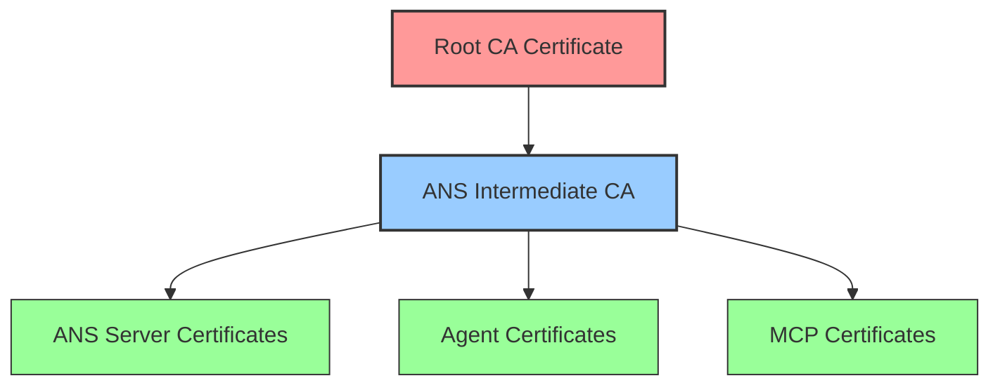

### 2.2 Certificate Structure

X.509 certificates used in the ANS ecosystem have the following extensions and properties:

| Extension/Attribute | Root CA | Intermediate CA | Server Certs | Agent Certs | MCP Certs |
|---------------------|---------|-----------------|--------------|-------------|-----------|
| Key Usage | Certificate Sign, CRL Sign | Certificate Sign, CRL Sign | Digital Signature, Key Encipherment | Digital Signature | Digital Signature, Key Encipherment |
| Extended Key Usage | None | TLS Server Auth, TLS Client Auth | TLS Server Auth | TLS Client Auth | TLS Server Auth, TLS Client Auth |
| Subject Alt Names | None | None | DNS names | Agent ID URI | MCP ID URI |
| Basic Constraints | CA:TRUE, pathlen:1 | CA:TRUE, pathlen:0 | CA:FALSE | CA:FALSE | CA:FALSE |
| CRL Distribution Point | None | URI to CRL | URI to CRL | URI to CRL | URI to CRL |
| Authority Info Access | None | URI to OCSP | URI to OCSP | URI to OCSP | URI to OCSP |
| Validity Period | 10 years | 5 years | 1 year | 1 year | 2 years |

### 2.3 Certificate Lifecycle

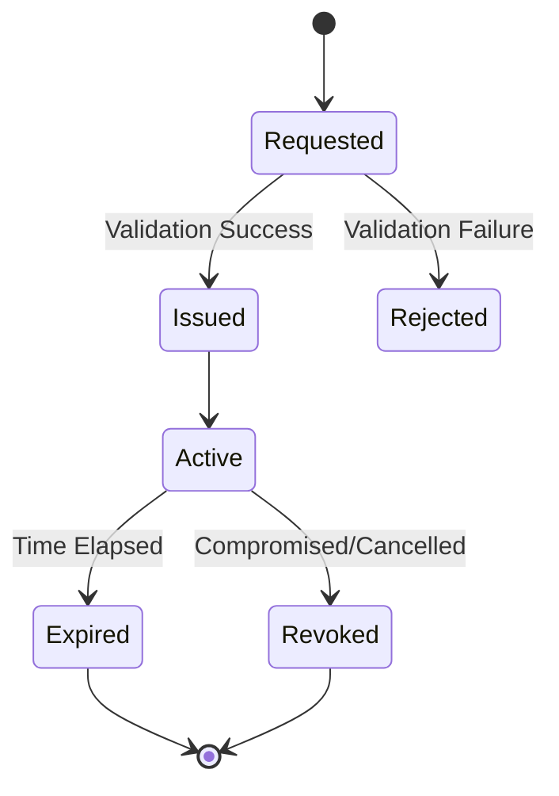

### 2.4 Certificate Generation Process

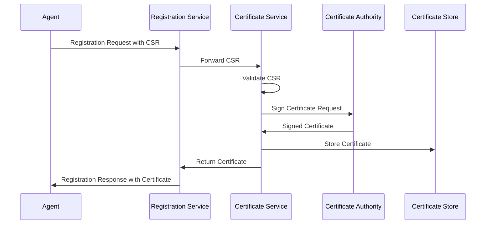

## 3. Authentication and Authorization

### 3.1 Authentication Methods

| Client Type | Primary Auth Method | Secondary Auth Method | Restrictions |
|-------------|--------------------|-----------------------|--------------|
| Agent | Certificate-based | API Key (limited) | Key operations require certificate |
| MCP Server | Certificate-based | None | Full access with proper roles |
| Admin User | Certificate + MFA | None | Access to admin endpoints only |
| Internal Service | mTLS | Service account | Internal network only |

### 3.2 Authorization Model

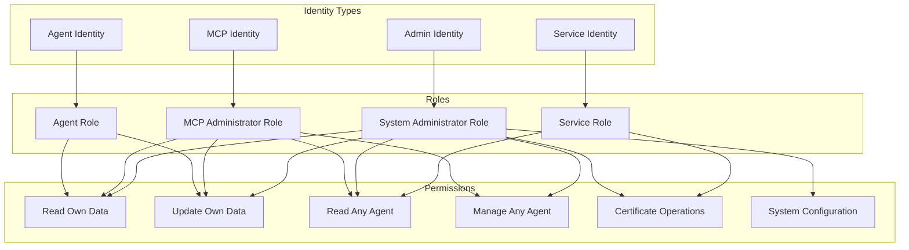

### 3.3 Role-Based Access Control Matrix

| Operation | Agent Role | MCP Admin | System Admin | Service Role |
|-----------|------------|-----------|--------------|--------------|
| Register self | ✓ | ✓ | ✓ | ✓ |
| Update self | ✓ | ✓ | ✓ | ✓ |
| Deregister self | ✓ | ✓ | ✓ | ✓ |
| Resolve any agent | ✓ | ✓ | ✓ | ✓ |
| Query by capability | ✓ | ✓ | ✓ | ✓ |
| Register other agent | ✗ | ✓ | ✓ | ✗ |
| Update other agent | ✗ | ✓ | ✓ | ✗ |
| Deregister other agent | ✗ | ✓ | ✓ | ✗ |
| Issue certificate | ✗ | ✓ | ✓ | ✓ |
| Revoke certificate | ✗ | ✓ | ✓ | ✓ |
| View security events | ✗ | ✓ | ✓ | ✓ |
| Configure system | ✗ | ✗ | ✓ | ✗ |

## 4. Data Protection

### 4.1 Data Classification

| Data Category | Classification | Protection Measures | Example |
|---------------|---------------|---------------------|---------|
| Agent Public Keys | Public | Integrity protection | Public keys in certificates |
| Agent Endpoints | Controlled | Access control, TLS | Connection endpoints |
| Certificate Private Keys | Secret | Never stored by ANS | Agent's private keys |
| System Private Keys | Secret | HSM, limited access | ANS signing keys |
| Security Events | Confidential | Encryption, access control | Threat reports |
| Agent Capabilities | Controlled | Access control | Advertised capabilities |
| System Configuration | Confidential | Encryption, access control | Security parameters |

### 4.2 Data Protection in Transit

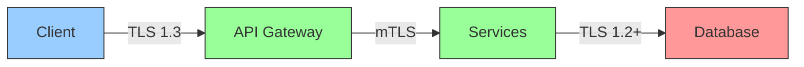

All connections use the following TLS parameters:
- Minimum TLS version: TLS 1.2 (TLS 1.3 preferred)
- Cipher suites: Only strong AEAD ciphers (e.g., TLS_AES_256_GCM_SHA384)
- Perfect Forward Secrecy: Required
- Certificate validation: Full chain validation

### 4.3 Data Protection at Rest

| Data Store | Encryption Method | Key Management | Access Control |
|------------|-------------------|----------------|----------------|
| Database | Transparent encryption | Application-managed keys | DAC + encryption |
| Certificate Store | File-level encryption | HSM-protected keys | DAC + encryption |
| Security Event Store | Transparent encryption | Application-managed keys | DAC + encryption |
| Configuration Files | File-level encryption | HSM-protected keys | DAC + encryption |
| Backup Files | Full encryption | Separate key hierarchy | Strict access control |

## 5. Threat Modeling

### 5.1 Threat Modeling Integration Architecture

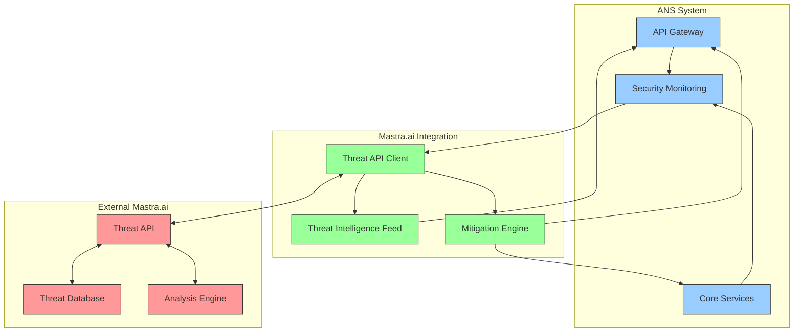

### 5.2 Threat Categories and Mitigations

| Threat Category | Examples | Detection Method | Mitigation Strategy |
|-----------------|----------|------------------|---------------------|
| Authentication Bypass | Certificate forgery, replay attacks | Certificate validation, request signing | Strict validation, message IDs, timestamps |
| Denial of Service | API flooding, resource exhaustion | Rate monitoring, pattern detection | Rate limiting, circuit breakers, resource isolation |
| Data Exfiltration | Mass harvesting, targeted scraping | Anomaly detection, pattern analysis | Rate limiting, access throttling, data minimization |
| Man in the Middle | TLS interception, DNS hijacking | Certificate pinning, HSTS | Certificate transparency, connection validation |
| Privilege Escalation | Role manipulation, token theft | Permission validation, audit logging | Least privilege, role verification, session validation |
| API Abuse | Parameter manipulation, injection | Input validation, pattern matching | Schema validation, prepared statements, output encoding |

### 5.3 Security Event Processing

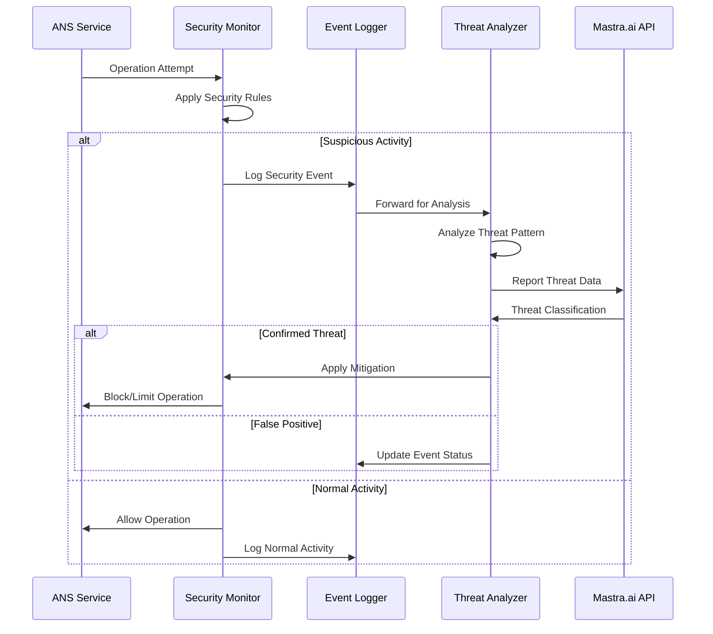

### 5.4 Adaptive Security Controls

The ANS system implements adaptive security controls that adjust based on threat intelligence:

| Threat Level | API Rate Limits | Authentication Requirements | Logging Level | Monitoring Intensity |
|--------------|----------------|---------------------------|--------------|---------------------|
| Normal | Standard (100/min) | Certificate validation | INFO | Standard |
| Elevated | Reduced (50/min) | Certificate + enhanced validation | DEBUG | Enhanced |
| High | Minimal (20/min) | Certificate + secondary validation | TRACE | Intensive |
| Critical | Emergency only (5/min) | Certificate + MFA for admins | TRACE + alerts | Maximum |

## 6. API Security

### 6.1 API Security Controls

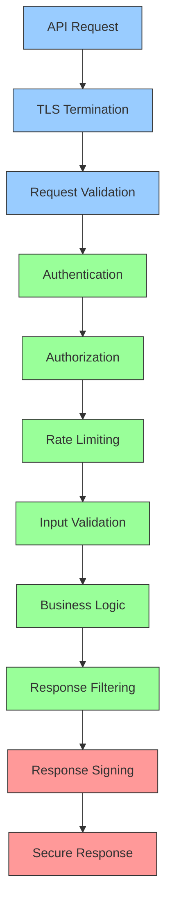

### 6.2 API Security Headers

| Header | Purpose | Value |
|--------|---------|-------|
| Strict-Transport-Security | Enforce HTTPS | max-age=31536000; includeSubDomains; preload |
| Content-Security-Policy | Prevent XSS | default-src 'self'; script-src 'self'; object-src 'none' |
| X-Content-Type-Options | Prevent MIME sniffing | nosniff |
| X-Frame-Options | Prevent clickjacking | DENY |
| Cache-Control | Prevent caching sensitive data | no-store, max-age=0 |
| X-Request-ID | Request tracing | UUID generated per request |
| X-RateLimit-Limit | Inform rate limits | Numeric limit value |
| X-RateLimit-Remaining | Inform remaining quota | Numeric remaining value |

### 6.3 Input Validation Strategy

All API inputs are validated through a multi-tiered approach:

1. **Schema Validation**: JSON Schema validation for all request bodies
2. **Type Checking**: Strong type checking for all parameters
3. **Semantic Validation**: Business logic validation of values
4. **Sanitization**: Removal of potentially dangerous content
5. **Size Limits**: Enforced limits on request sizes
6. **Pattern Matching**: Regex validation for structured fields

## 7. Security Monitoring and Incident Response

### 7.1 Security Monitoring Architecture

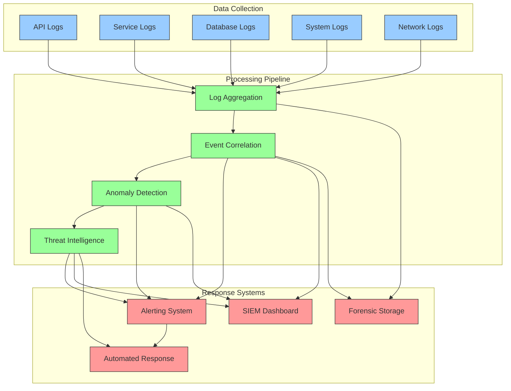

### 7.2 Security Events and Alerting

| Event Category | Severity | Alert Channel | Response SLA | Example Events |
|----------------|----------|---------------|--------------|----------------|
| Authentication Failure | Medium | Dashboard, Email | 4 hours | Multiple failed logins, invalid certificates |
| Authorization Violation | High | Dashboard, Email, SMS | 1 hour | Access attempts to unauthorized resources |
| Certificate Violation | High | Dashboard, Email, SMS | 1 hour | Invalid, expired, or revoked certificates |
| Rate Limit Exceeded | Medium | Dashboard, Email | 4 hours | API quota exceeded, potential DoS |
| Suspicious Query | Medium | Dashboard, Email | 4 hours | Unusual query patterns, potential data scraping |
| Database Attack | Critical | Dashboard, Email, SMS, Call | 15 minutes | SQL injection attempts, unauthorized access |
| System Abuse | High | Dashboard, Email, SMS | 1 hour | Resource exhaustion, improper API usage |
| Configuration Change | Medium | Dashboard, Email | 4 hours | System configuration modifications |

### 7.3 Incident Response Process

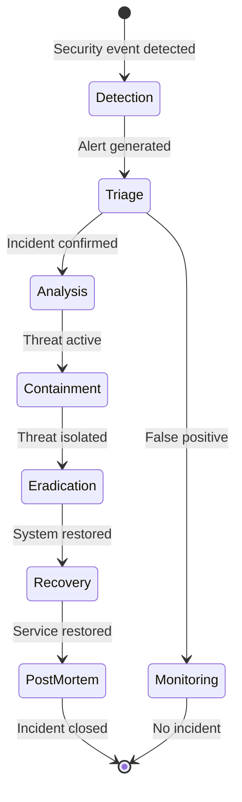

## 8. Secure Development Practices

### 8.1 Security in SDLC

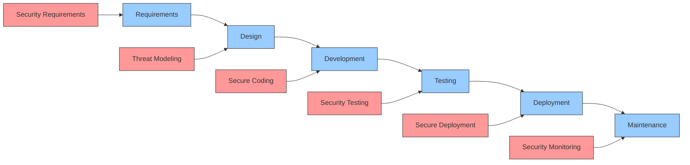

### 8.2 Security Testing Strategy

| Testing Type | When Performed | Tools | Coverage |
|--------------|----------------|-------|----------|
| Static Analysis | Pre-commit, CI | ESLint with security plugins, SonarQube | 100% of code |
| Dependency Scanning | CI, Weekly | NPM Audit, Snyk | All dependencies |
| Dynamic Analysis | CI, Pre-release | OWASP ZAP, Custom scripts | Critical API endpoints |
| Penetration Testing | Quarterly | External security team | Full system |
| Fuzzing | CI, Monthly | Custom fuzzing framework | Input handling |
| Security Review | PR approval, Pre-release | Manual code review | Security-critical code |

### 8.3 Secure Coding Standards

The ANS follows these security-focused coding standards:

1. **Input Validation**: All inputs validated at service boundaries
2. **Output Encoding**: Context-specific output encoding
3. **Parameterized Queries**: No dynamic SQL, use prepared statements
4. **Error Handling**: Security-sensitive errors logged but generalized to users
5. **Cryptography**: Use vetted libraries, no custom crypto
6. **Authentication**: Multi-factor for sensitive operations
7. **Authorization**: Verify permissions on every request
8. **Secrets Management**: No hardcoded secrets, use environment or secure storage
9. **Logging**: No sensitive data in logs, structured logging format
10. **Dependencies**: Regular updates, vulnerability scanning

## 9. Compliance and Risk Management

### 9.1 Security Controls Mapping

| Security Domain | ANS Controls | Relevant Standards |
|-----------------|--------------|-------------------|
| Identity & Access | Certificate-based auth, RBAC, least privilege | NIST SP 800-53 (AC), ISO 27001 (A.9) |
| Cryptography | TLS 1.3, strong ciphers, certificate validation | NIST SP 800-53 (SC), ISO 27001 (A.10) |
| Data Protection | Encryption in transit and at rest, data classification | NIST SP 800-53 (SC), ISO 27001 (A.8) |
| Logging & Monitoring | Comprehensive logging, security monitoring | NIST SP 800-53 (AU), ISO 27001 (A.12) |
| System Security | Secure configuration, threat detection | NIST SP 800-53 (SI), ISO 27001 (A.13) |
| API Security | Input validation, rate limiting, secure headers | OWASP API Security Top 10 |

### 9.2 Risk Management

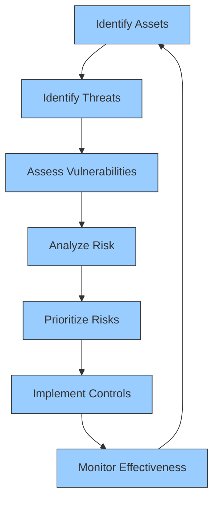

### 9.3 Security Assessment Schedule

| Assessment Type | Frequency | Conducted By | Artifacts |
|-----------------|-----------|--------------|-----------|
| Vulnerability Scan | Weekly | Automated tools | Vulnerability report |
| Security Control Review | Monthly | Security team | Control assessment |
| Penetration Test | Quarterly | External team | Pentest report |
| Risk Assessment | Bi-annually | Security & business teams | Risk register |
| Compliance Audit | Annually | Compliance team | Audit report |
| Red Team Exercise | Annually | External specialists | Attack narrative |

## 10. Future Security Enhancements

### 10.1 Security Roadmap

| Enhancement | Benefits | Timeline | Dependencies |
|-------------|----------|----------|--------------|
| Hardware Security Module (HSM) | Stronger key protection | Q3 2025 | Infrastructure, budget |
| FIDO2/WebAuthn Support | Phishing-resistant auth | Q4 2025 | Client support, UX design |
| Behavioral Analytics | Advanced threat detection | Q1 2026 | Data collection, ML models |
| Automated Incident Response | Faster threat mitigation | Q2 2026 | Threat intelligence integration |
| Zero-Knowledge Proofs | Enhanced privacy | Q3 2026 | Cryptographic library support |
| Quantum-Safe Cryptography | Future-proof security | Q4 2026 | Standards finalization |

### 10.2 Continuous Security Improvement Process

```mermaid
graph TD
    A[Security Requirements] --> B[Security Architecture]
    B --> C[Implementation]
    C --> D[Security Testing]
    D --> E[Deployment]
    E --> F[Monitoring]
    F --> G[Improvement Identification]
    G --> A
    
    classDef process fill:#9cf,stroke:#333,stroke-width:1px;
    class A,B,C,D,E,F,G process;