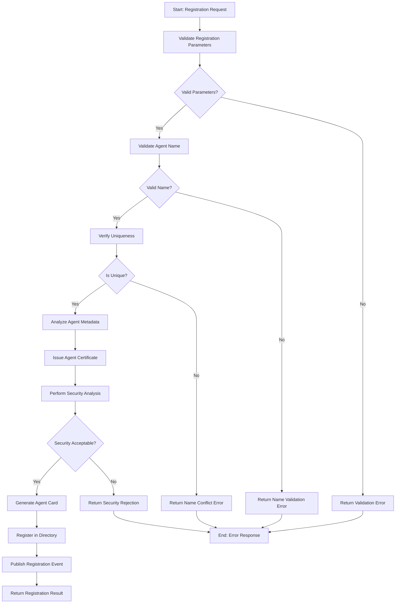

# Agent Registration Workflow

## Overview

The Agent Registration Workflow manages the process of registering agents with the Agent Name Service (ANS), establishing secure agent identities, issuing credentials, and making agents discoverable within the ecosystem. This workflow ensures proper agent validation, security assessment, and integration into the agent directory while maintaining naming conventions and security policies.

## Workflow Diagram



## Input Schema

The workflow accepts agent registration requests with the following information:

```typescript
const agentRegistrationSchema = z.object({
  agentName: z.string()
    .min(3).max(64)
    .regex(/^[a-zA-Z0-9][a-zA-Z0-9._-]*$/)
    .describe('The unique name for the agent'),
  
  ownershipInfo: z.object({
    owner: z.string()
      .describe('Entity that owns or is responsible for this agent'),
    
    ownerType: z.enum(['INDIVIDUAL', 'ORGANIZATION', 'SYSTEM'])
      .describe('Type of entity that owns the agent'),
    
    contactInfo: z.string().email().optional()
      .describe('Contact information for the owner'),
    
    department: z.string().optional()
      .describe('Department or division within the organization')
  }),
  
  agentMetadata: z.object({
    description: z.string().max(500)
      .describe('Human-readable description of the agent'),
    
    purpose: z.string().max(200)
      .describe('Intended purpose of the agent'),
    
    version: z.string()
      .describe('Version identifier of the agent'),
    
    capabilities: z.array(z.string())
      .describe('List of capabilities this agent provides'),
    
    supportedProtocols: z.array(z.string())
      .describe('Protocols supported by this agent'),
    
    endpoints: z.array(z.object({
      type: z.string(),
      url: z.string().url(),
      protocol: z.string(),
      description: z.string().optional()
    })).optional()
      .describe('Endpoints for communicating with this agent'),
    
    tags: z.array(z.string()).optional()
      .describe('Tags for categorization and discovery'),
    
    customMetadata: z.record(z.any()).optional()
      .describe('Additional custom metadata properties')
  }),
  
  securityOptions: z.object({
    certificateType: z.enum(['STANDARD', 'EXTENDED', 'ENHANCED']).default('STANDARD')
      .describe('Type of certificate to issue'),
    
    certificateValidityDays: z.number().int().positive().default(365)
      .describe('Validity period in days for the certificate'),
    
    requestSecurityAnalysis: z.boolean().default(true)
      .describe('Whether to perform security analysis on the agent'),
    
    securityLevel: z.enum(['BASIC', 'STANDARD', 'ENHANCED']).default('STANDARD')
      .describe('Level of security analysis to perform'),
    
    allowedCapabilities: z.array(z.string()).optional()
      .describe('Explicitly allowed capabilities (whitelist)'),
    
    restrictedCapabilities: z.array(z.string()).optional()
      .describe('Explicitly restricted capabilities (blacklist)')
  }).optional(),
  
  registrationOptions: z.object({
    visibility: z.enum(['PUBLIC', 'PRIVATE', 'LIMITED']).default('PUBLIC')
      .describe('Visibility of the agent in the directory'),
    
    accessControl: z.array(z.object({
      principal: z.string(),
      permissions: z.array(z.enum(['READ', 'DISCOVER', 'INTERACT', 'MODIFY', 'ADMINISTER']))
    })).optional()
      .describe('Access control rules for the agent'),
    
    aliasNames: z.array(z.string()).optional()
      .describe('Alternative names for this agent'),
    
    namespace: z.string().optional()
      .describe('Namespace to register the agent in'),
    
    expirationPolicy: z.object({
      autoRenew: z.boolean().default(false),
      notificationThreshold: z.number().int().positive().default(30),
      expirationAction: z.enum(['NOTIFY', 'SUSPEND', 'ARCHIVE', 'DELETE']).default('NOTIFY')
    }).optional()
      .describe('Policy for handling registration expiration')
  }).optional(),
  
  registrationContext: z.object({
    requesterId: z.string()
      .describe('ID of the requester registering the agent'),
    
    sourceIp: z.string().optional()
      .describe('Source IP address of the registration request'),
    
    registrationTime: z.string().datetime().optional()
      .describe('Timestamp of the registration request'),
    
    registrationToken: z.string().optional()
      .describe('Authorization token for registration if required'),
    
    correlationId: z.string().uuid().optional()
      .describe('Correlation ID for tracking this registration')
  })
});
```

## Workflow Steps

### 1. Validate Registration Parameters

This step validates the registration request parameters.

**Input:** Registration request
**Output:**
- Validation result
- Parameter validation details
- Any validation issues

The validation process:
- Checks parameter presence
- Validates parameter types
- Checks value constraints
- Verifies format compliance
- Normalizes input data
- Sanitizes inputs
- Identifies structural issues

### 2. Validate Agent Name

This step validates the agent name for compliance with naming rules.

**Input:** Agent name
**Output:**
- Name validation result
- Validation details
- Any validation issues

The name validation process:
- Checks name length
- Validates character set
- Verifies format compliance
- Checks for reserved names
- Validates against naming patterns
- Checks for prohibited terms
- Validates namespace compliance if applicable

### 3. Verify Uniqueness

This step verifies that the agent name is unique within the registry.

**Input:** Validated agent name
**Output:**
- Uniqueness check result
- Similar name suggestions if not unique
- Any verification issues

The uniqueness verification:
- Checks exact name match
- Validates case-insensitive uniqueness
- Checks namespace uniqueness
- Identifies similar existing names
- Verifies alias uniqueness
- Checks for previously used names
- Applies namespace-specific rules

### 4. Analyze Agent Metadata

This step analyzes the agent metadata for completeness and compliance.

**Input:** Agent metadata
**Output:**
- Metadata analysis results
- Compliance assessment
- Metadata quality score
- Any analysis issues

The metadata analysis:
- Validates description quality
- Checks capability declarations
- Validates endpoint information
- Analyzes protocol declarations
- Checks for metadata completeness
- Validates custom metadata
- Identifies potential issues
- Generates quality metrics

### 5. Issue Agent Certificate

This step issues a cryptographic certificate for the agent.

**Input:** Agent information and certificate options
**Output:**
- Generated certificate
- Certificate metadata
- Any issuance issues

The certificate issuance:
- Generates cryptographic key pair
- Creates certificate signing request
- Applies certificate parameters
- Signs certificate with CA key
- Sets certificate attributes
- Includes identity information
- Applies validity period
- Records certificate metadata

### 6. Perform Security Analysis

This step analyzes the agent for security concerns.

**Input:** Agent data and security options
**Output:**
- Security analysis results
- Threat assessment
- Security recommendations
- Any security issues

The security analysis:
- Analyzes declared capabilities
- Evaluates requested permissions
- Checks for suspicious patterns
- Analyzes endpoint security
- Evaluates owner reputation
- Performs policy compliance checks
- Generates threat score
- Produces security recommendations

### 7. Generate Agent Card

This step generates the agent card containing agent information and credentials.

**Input:** Agent data, certificate, and security analysis
**Output:**
- Generated agent card
- Card metadata
- Any generation issues

The card generation process:
- Formats agent information
- Incorporates certificate data
- Includes metadata selections
- Encodes security information
- Sets discoverability options
- Formats for storage
- Signs the agent card
- Sets expiration information

### 8. Register in Directory

This step registers the agent in the directory service.

**Input:** Agent card and registration options
**Output:**
- Registration status
- Directory entry
- Any registration issues

The registration process:
- Creates directory entry
- Applies visibility settings
- Sets access control rules
- Indexes for discovery
- Applies namespace organization
- Sets expiration policy
- Records registration metadata
- Creates audit trail

### 9. Publish Registration Event

This step publishes an event notifying of the new agent registration.

**Input:** Agent registration data
**Output:**
- Event publication status
- Event details
- Any publication issues

The event publication:
- Formats registration event
- Selects appropriate topics
- Sets event attributes
- Publishes to event system
- Notifies interested parties
- Records delivery status
- Handles publication failures
- Maintains event audit trail

## Error Handling

The workflow handles various error conditions:
- Parameter validation failures
- Name validation issues
- Name uniqueness conflicts
- Metadata analysis problems
- Certificate issuance failures
- Security analysis rejections
- Card generation errors
- Directory registration failures
- Event publication issues

Each error includes:
- Error code
- Description
- Remediation suggestions
- Severity level

## Integration Points

The workflow integrates with:
- Parameter Validation Service for input validation
- Name Validation Service for name compliance checks
- Directory Service for uniqueness verification
- Metadata Analysis Service for metadata validation
- Certificate Authority for certificate issuance
- Security Analysis Service for threat assessment
- Card Generation Service for agent card creation
- Registration Service for directory registration
- Event Service for notification publication

## Certificate Types

The workflow supports different certificate types based on security requirements:

1. **STANDARD** - Basic agent authentication:
   - Standard key size (2048-bit RSA or equivalent)
   - Basic identity verification
   - Standard validity period
   - Common name and basic attributes
   - Regular renewal process
   - Suitable for most agents

2. **EXTENDED** - Enhanced authentication features:
   - Larger key size (3072-bit RSA or equivalent)
   - Extended identity verification
   - Additional certificate attributes
   - Extended validation process
   - Enhanced renewal requirements
   - Suitable for sensitive operations

3. **ENHANCED** - Maximum security for critical agents:
   - Maximum key size (4096-bit RSA or equivalent)
   - Comprehensive identity verification
   - Complete attribute set
   - Hardware-backed key storage recommended
   - Strict renewal requirements
   - Suitable for system-critical functions

## Security Levels

The workflow supports different security analysis levels:

1. **BASIC** - Minimal security screening:
   - Basic capability review
   - Standard pattern matching
   - Simple threat detection
   - Fastest processing time
   - Limited security assessment
   - Suitable for low-risk agents

2. **STANDARD** - Balanced security assessment:
   - Comprehensive capability analysis
   - Pattern and behavior analysis
   - Threat modeling
   - Reasonable processing time
   - Good security coverage
   - Default for most agents

3. **ENHANCED** - Thorough security evaluation:
   - Deep capability analysis
   - Advanced threat modeling
   - Behavioral simulation
   - Longer processing time
   - Maximum security coverage
   - Required for critical systems

## Usage Examples

```typescript
// Basic agent registration
const basicRegistration = await triggerWorkflow('agent-registration-workflow', {
  agentName: 'weather-service-agent',
  ownershipInfo: {
    owner: 'Weather Systems Inc',
    ownerType: 'ORGANIZATION',
    contactInfo: 'admin@weathersystems.example'
  },
  agentMetadata: {
    description: 'Provides weather forecasting and current conditions',
    purpose: 'Weather information services',
    version: '1.0.0',
    capabilities: ['weather-forecast', 'current-conditions', 'historical-data'],
    supportedProtocols: ['REST', 'GraphQL'],
    endpoints: [
      {
        type: 'API',
        url: 'https://api.weather-service.example/v1',
        protocol: 'REST',
        description: 'Primary REST API endpoint'
      }
    ],
    tags: ['weather', 'forecast', 'meteorology']
  },
  registrationContext: {
    requesterId: 'admin-user',
    correlationId: '550e8400-e29b-41d4-a716-446655440000'
  }
});

// Enhanced security registration for financial agent
const secureRegistration = await triggerWorkflow('agent-registration-workflow', {
  agentName: 'payment-processor-agent',
  ownershipInfo: {
    owner: 'Secure Financial Services Ltd',
    ownerType: 'ORGANIZATION',
    contactInfo: 'security@securefinancial.example',
    department: 'Payment Systems'
  },
  agentMetadata: {
    description: 'Processes payment transactions securely with end-to-end encryption',
    purpose: 'Financial transaction processing',
    version: '2.5.1',
    capabilities: ['payment-processing', 'transaction-validation', 'fraud-detection'],
    supportedProtocols: ['HTTPS', 'TLS-1.3'],
    endpoints: [
      {
        type: 'API',
        url: 'https://api.securepayments.example/v3',
        protocol: 'HTTPS',
        description: 'Secure payment processing endpoint'
      }
    ],
    tags: ['payments', 'financial', 'secure', 'transactions'],
    customMetadata: {
      complianceCertifications: ['PCI-DSS', 'ISO-27001'],
      encryptionLevel: 'AES-256-GCM',
      auditCapabilities: true
    }
  },
  securityOptions: {
    certificateType: 'ENHANCED',
    certificateValidityDays: 180,
    requestSecurityAnalysis: true,
    securityLevel: 'ENHANCED',
    restrictedCapabilities: ['system-admin', 'file-system-access']
  },
  registrationOptions: {
    visibility: 'LIMITED',
    accessControl: [
      {
        principal: 'financial-system-group',
        permissions: ['DISCOVER', 'INTERACT']
      },
      {
        principal: 'security-admin-group',
        permissions: ['READ', 'DISCOVER', 'ADMINISTER']
      }
    ],
    expirationPolicy: {
      autoRenew: true,
      notificationThreshold: 45,
      expirationAction: 'SUSPEND'
    }
  },
  registrationContext: {
    requesterId: 'security-officer',
    registrationToken: 'sec-reg-token-12345',
    correlationId: '53de56c8-c2c9-4c6c-8390-143982689e7e'
  }
});

// System component registration within namespace
const systemComponentRegistration = await triggerWorkflow('agent-registration-workflow', {
  agentName: 'logging-service',
  ownershipInfo: {
    owner: 'Core Platform Team',
    ownerType: 'SYSTEM',
    department: 'Platform Engineering'
  },
  agentMetadata: {
    description: 'Centralized logging service for system components',
    purpose: 'Log aggregation and analysis',
    version: '3.1.2',
    capabilities: ['log-ingestion', 'log-search', 'alert-generation'],
    supportedProtocols: ['GELF', 'Syslog', 'HTTP'],
    endpoints: [
      {
        type: 'Ingestion',
        url: 'https://logs.internal.example/ingest',
        protocol: 'HTTPS',
        description: 'Log ingestion endpoint'
      },
      {
        type: 'Query',
        url: 'https://logs.internal.example/query',
        protocol: 'GraphQL',
        description: 'Log query and search interface'
      }
    ],
    tags: ['logging', 'monitoring', 'observability']
  },
  securityOptions: {
    certificateType: 'EXTENDED',
    securityLevel: 'STANDARD',
    allowedCapabilities: ['log-ingestion', 'log-search', 'alert-generation']
  },
  registrationOptions: {
    visibility: 'LIMITED',
    namespace: 'system.core',
    aliasNames: ['central-logs', 'log-aggregator']
  },
  registrationContext: {
    requesterId: 'system-automation',
    sourceIp: '10.0.1.5',
    correlationId: '7842e87a-5e9c-4aeb-b2e1-cb7322f3ba3f'
  }
});
```

## Implementation Notes

- Agent names follow DNS-like hierarchical naming
- Certificates use X.509 format with standard extensions
- Security analysis uses both static and dynamic assessment
- Directory entries may include discoverable and non-discoverable portions
- Registration events follow a standardized event schema
- Namespaces provide organizational structure to the agent directory
- Registration may require approval workflows for certain types of agents
- Performance optimizations focus on certificate generation and security analysis stages

## Agent Visibility Levels

The workflow supports different agent visibility levels:

1. **PUBLIC** - Discoverable by all system users:
   - Appears in global directory
   - Discoverable via search
   - Basic information visible to all
   - Standard access control
   - Suitable for generally available services
   
2. **PRIVATE** - Visible only to authorized users:
   - Not listed in global directory
   - Only discoverable by authorized users
   - Requires explicit access permission
   - Strict access control
   - Suitable for sensitive or internal services

3. **LIMITED** - Restricted visibility to specific entities:
   - Limited directory presence
   - Discoverable within authorized scope
   - Granular access control
   - Visibility rules apply
   - Suitable for multi-tenant environments

## Registration Result Schema

The workflow returns a registration result with the following information:

```typescript
const registrationResultSchema = z.object({
  status: z.enum(['SUCCESS', 'PARTIAL_SUCCESS', 'FAILURE']),
  
  statusCode: z.number(),
  
  message: z.string(),
  
  registeredAgent: z.object({
    name: z.string()
      .describe('The registered agent name'),
    
    registrationId: z.string()
      .describe('Unique registration identifier'),
    
    certificate: z.object({
      publicCertificate: z.string()
        .describe('The public certificate for the agent'),
      
      expiryDate: z.string().datetime()
        .describe('When the certificate expires'),
      
      certificateType: z.string()
        .describe('Type of certificate issued'),
      
      fingerprint: z.string()
        .describe('Certificate fingerprint for verification')
    }),
    
    agentCard: z.string()
      .describe('The generated agent card'),
    
    directoryEntry: z.object({
      namespace: z.string().optional()
        .describe('Namespace containing the agent'),
      
      visibility: z.string()
        .describe('Visibility level of the agent'),
      
      url: z.string().optional()
        .describe('URL to access the agent entry')
    }),
    
    registrationDate: z.string().datetime()
      .describe('When the agent was registered'),
    
    expirationDate: z.string().datetime().optional()
      .describe('When the registration expires if applicable')
  }).optional(),
  
  securityAssessment: z.object({
    threatScore: z.number().min(0).max(100)
      .describe('Security threat score (0-100)'),
    
    securityLevel: z.string()
      .describe('Security assessment level performed'),
    
    findings: z.array(z.object({
      category: z.string(),
      severity: z.enum(['INFO', 'LOW', 'MEDIUM', 'HIGH', 'CRITICAL']),
      description: z.string(),
      recommendation: z.string().optional()
    })).optional()
      .describe('Security findings if any'),
    
    approvedCapabilities: z.array(z.string()).optional()
      .describe('Capabilities approved for this agent'),
    
    restrictedCapabilities: z.array(z.string()).optional()
      .describe('Capabilities explicitly restricted')
  }).optional(),
  
  registrationEvent: z.object({
    eventId: z.string()
      .describe('ID of the published registration event'),
    
    timestamp: z.string().datetime()
      .describe('When the event was published'),
    
    topics: z.array(z.string())
      .describe('Event topics the registration was published to')
  }).optional(),
  
  error: z.object({
    code: z.string(),
    details: z.string(),
    category: z.string(),
    remediation: z.string().optional()
  }).optional()
});
```

## Performance Considerations

- Certificate generation is the most compute-intensive operation
- Security analysis may require substantial processing time at higher levels
- Caching strategies are employed for name validation and uniqueness checks
- Database operations are optimized for agent lookup and registration
- Asynchronous processing is used for non-critical post-registration tasks
- Resource allocation varies based on certificate type and security level
- Event publication uses buffering to handle high registration volumes
- Performance metrics are collected for continuous optimization

## Security Considerations

- Name validation prevents injection attacks and name squatting
- Certificate issuance follows security best practices
- Private keys are protected throughout the registration process
- Security analysis identifies potential threats before registration
- Access controls enforce proper registration authorization
- Audit logs maintain a complete record of registration activities
- Rate limiting prevents registration abuse
- Reserved names protect system integrity

## Registration Expiration Policies

Registration expiration policies manage the lifecycle of agent registrations:

1. **Auto-renewal** - Whether to automatically renew registrations
2. **Notification threshold** - Days before expiration to send notifications
3. **Expiration actions** - What happens when registrations expire:
   - **NOTIFY** - Send notifications only
   - **SUSPEND** - Temporarily disable the agent
   - **ARCHIVE** - Move to archived state but retain information
   - **DELETE** - Completely remove the registration

## TEST Anchors

- TEST: Successfully validates registration parameters for all required fields
- TEST: Correctly validates agent names against naming rules
- TEST: Properly verifies name uniqueness with case-insensitive comparison
- TEST: Accurately analyzes agent metadata for completeness
- TEST: Successfully issues certificates of all supported types
- TEST: Correctly performs security analysis at all security levels
- TEST: Properly generates agent cards with all required information
- TEST: Successfully registers agents in the directory with correct attributes
- TEST: Properly publishes registration events to notification system
- TEST: Correctly handles various error conditions during registration
- TEST: Properly enforces security restrictions on agent capabilities
- TEST: Correctly implements different agent visibility levels