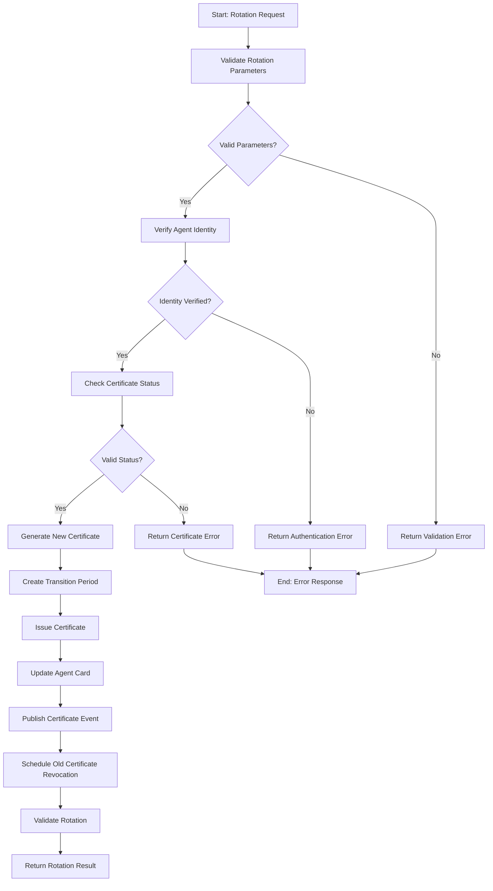

# Certificate Rotation Workflow

## Overview

The Certificate Rotation Workflow manages the secure, automated rotation of agent certificates within the Agent Name Service (ANS). This workflow handles certificate renewal, replacement, and revocation processes to maintain security, accommodate key changes, and enforce certificate policies throughout the agent lifecycle. The workflow ensures uninterrupted agent operation during certificate transitions while maintaining cryptographic trust.

## Workflow Diagram



## Input Schema

The workflow accepts certificate rotation requests with the following information:

```typescript
const certificateRotationSchema = z.object({
  rotationRequest: z.object({
    agentName: z.string()
      .describe('The name of the agent requiring certificate rotation'),
    
    rotationType: z.enum(['RENEWAL', 'REPLACEMENT', 'EMERGENCY', 'SCHEDULED'])
      .describe('Type of certificate rotation to perform'),
    
    currentCertificateId: z.string()
      .describe('Identifier of the current certificate'),
    
    rotationReason: z.enum([
      'EXPIRATION', 'KEY_COMPROMISE', 'POLICY_CHANGE', 
      'ALGORITHM_UPGRADE', 'OWNER_CHANGE', 'ROUTINE', 'OTHER'
    ])
      .describe('Reason for the certificate rotation'),
    
    additionalDetails: z.string().optional()
      .describe('Additional details about the rotation reason')
  }),
  
  certificateOptions: z.object({
    certificateType: z.enum(['STANDARD', 'EXTENDED', 'ENHANCED']).default('STANDARD')
      .describe('Type of new certificate to issue'),
    
    keyAlgorithm: z.enum(['RSA-2048', 'RSA-3072', 'RSA-4096', 'ECDSA-P256', 'ECDSA-P384', 'ED25519'])
      .default('RSA-2048')
      .describe('Cryptographic algorithm for the new certificate'),
    
    validityPeriod: z.number().int().positive().default(365)
      .describe('Validity period in days for the new certificate'),
    
    certificateAttributes: z.record(z.string()).optional()
      .describe('Additional attributes to include in the certificate'),
    
    certificateExtensions: z.array(z.object({
      oid: z.string(),
      critical: z.boolean().default(false),
      value: z.string()
    })).optional()
      .describe('X.509 extensions to include in the certificate')
  }).optional(),
  
  rotationOptions: z.object({
    transitionPeriod: z.number().int().min(0).max(90).default(7)
      .describe('Overlap period in days when both certificates are valid'),
    
    immediateRevocation: z.boolean().default(false)
      .describe('Whether to immediately revoke the old certificate'),
    
    forceRotation: z.boolean().default(false)
      .describe('Force rotation even if not normally allowed'),
    
    notifyDependents: z.boolean().default(true)
      .describe('Whether to notify dependent systems about the rotation'),
    
    keepOldKeyPair: z.boolean().default(false)
      .describe('Whether to retain the old key pair'),
    
    updateDependencies: z.boolean().default(true)
      .describe('Whether to cascade update to dependent certificates')
  }).optional(),
  
  authenticationInfo: z.object({
    authMethod: z.enum(['CERTIFICATE', 'TOKEN', 'MULTI_FACTOR', 'SYSTEM'])
      .describe('Method used to authenticate the rotation request'),
    
    authCredential: z.string()
      .describe('Credential used for authentication'),
    
    authorizationProof: z.string().optional()
      .describe('Additional proof of authorization if required'),
    
    requesterIdentity: z.string()
      .describe('Identity of the requester')
  }),
  
  rotationContext: z.object({
    requestId: z.string().uuid()
      .describe('Unique identifier for this rotation request'),
    
    sourceSystem: z.string().optional()
      .describe('System initiating the rotation request'),
    
    requestTimestamp: z.string().datetime().optional()
      .describe('When the rotation was requested'),
    
    priority: z.enum(['LOW', 'NORMAL', 'HIGH', 'EMERGENCY']).default('NORMAL')
      .describe('Priority of the rotation request'),
    
    correlationId: z.string().optional()
      .describe('Correlation ID for tracking this rotation')
  }).optional()
});
```

## Workflow Steps

### 1. Validate Rotation Parameters

This step validates the rotation request parameters.

**Input:** Rotation request
**Output:**
- Validation result
- Parameter validation details
- Any validation issues

The validation process:
- Checks parameter presence
- Validates parameter types
- Checks value constraints
- Verifies format compliance
- Validates certificate options
- Sanitizes inputs
- Identifies structural issues

### 2. Verify Agent Identity

This step authenticates the request to verify authorization for certificate rotation.

**Input:** Authentication information and agent name
**Output:**
- Authentication result
- Identity verification details
- Authorization level
- Any authentication issues

The verification process includes:
- Verifies authentication credentials
- Validates authorization for the agent
- Checks permissions for certificate operations
- Validates requester identity
- Verifies authentication method
- Applies authentication policies
- Checks for delegation authorization
- Records verification details

### 3. Check Certificate Status

This step checks the status of the current certificate to determine if rotation is appropriate.

**Input:** Agent name and current certificate ID
**Output:**
- Certificate status
- Eligibility for rotation
- Certificate details
- Any certificate issues

The status check process:
- Retrieves current certificate
- Verifies certificate validity
- Checks expiration status
- Examines revocation status
- Validates certificate chain
- Checks policy compliance
- Determines rotation eligibility
- Identifies certificate constraints

### 4. Generate New Certificate

This step generates a new certificate based on the provided options.

**Input:** Agent information and certificate options
**Output:**
- Generated key pair
- Certificate signing request
- Certificate generation details
- Any generation issues

The generation process:
- Creates new key pair
- Generates certificate parameters
- Builds certificate request
- Sets certificate attributes
- Applies requested extensions
- Sets validity period
- Applies policy constraints
- Prepares for signing

### 5. Create Transition Period

This step establishes a transition period where both certificates are valid.

**Input:** New certificate, current certificate, and transition options
**Output:**
- Transition configuration
- Overlapping validity schedule
- Transition policies
- Any transition issues

The transition process:
- Calculates transition dates
- Sets overlapping validity period
- Creates transition record
- Configures revocation schedule
- Sets certificate precedence
- Applies transition policies
- Prepares notification schedule
- Records transition details

### 6. Issue Certificate

This step issues and signs the new certificate.

**Input:** Certificate signing request and certificate options
**Output:**
- Signed certificate
- Certificate metadata
- Certificate chain
- Any issuance issues

The issuance process:
- Validates certificate request
- Signs the certificate
- Sets certificate metadata
- Creates certificate chain
- Applies certificate policies
- Records issuance details
- Stores certificate securely
- Applies revocation protections

### 7. Update Agent Card

This step updates the agent card with the new certificate information.

**Input:** Agent information and new certificate
**Output:**
- Updated agent card
- Update details
- Previous card backup
- Any update issues

The update process:
- Retrieves current agent card
- Creates backup of current card
- Updates certificate reference
- Maintains historical certificate record
- Updates certificate metadata
- Signs updated agent card
- Validates updated card
- Records update details

### 8. Publish Certificate Event

This step publishes an event notifying of the certificate rotation.

**Input:** Agent information and certificate details
**Output:**
- Event publication status
- Event details
- Publication targets
- Any publication issues

The event publication:
- Creates rotation event
- Sets event attributes
- Publishes to notification system
- Notifies dependent systems
- Records publication details
- Handles delivery failures
- Records delivery receipts
- Maintains event history

### 9. Schedule Old Certificate Revocation

This step schedules the revocation of the old certificate.

**Input:** Old certificate details and revocation options
**Output:**
- Revocation schedule
- Revocation parameters
- Schedule confirmation
- Any scheduling issues

The scheduling process:
- Determines revocation timing
- Creates revocation record
- Sets revocation parameters
- Schedules revocation task
- Applies revocation policies
- Creates revocation notification
- Records scheduling details
- Sets up monitoring

### 10. Validate Rotation

This step validates the overall rotation process to ensure success.

**Input:** Rotation details and validation parameters
**Output:**
- Validation result
- Validation details
- Success metrics
- Any validation issues

The validation includes:
- Verifies new certificate
- Confirms agent card update
- Checks revocation schedule
- Validates event publication
- Confirms transition setup
- Performs integrity checks
- Verifies audit trail
- Records validation results

## Error Handling

The workflow handles various error conditions:
- Parameter validation failures
- Authentication and authorization failures
- Certificate status issues
- Certificate generation failures
- Transition period setup issues
- Certificate issuance problems
- Agent card update failures
- Event publication issues
- Revocation scheduling problems
- Rotation validation failures

Each error includes:
- Error code
- Description
- Remediation suggestions
- Severity level

## Integration Points

The workflow integrates with:
- Parameter Validation Service for input validation
- Authentication Service for identity verification
- Certificate Authority for certificate status and issuance
- Key Management Service for key pair generation
- Agent Directory for agent card updates
- Event Service for rotation notifications
- Revocation Service for certificate revocation
- Validation Service for process verification

## Rotation Types

The workflow supports different rotation types based on requirements:

1. **RENEWAL** - Standard certificate renewal:
   - Approaching expiration date
   - Same key pair may be retained
   - Standard validation checks
   - Normal transition period
   - Routine operation
   - Minimal service impact
   - Predictable scheduling

2. **REPLACEMENT** - Certificate replacement:
   - New key pair generation
   - Changed certificate attributes
   - Enhanced validation checks
   - Modified transition handling
   - Explicit dependent notification
   - Moderate service impact
   - Supports algorithm changes

3. **EMERGENCY** - Emergency certificate rotation:
   - Immediate security response
   - Mandatory new key pair
   - Expedited processing
   - Minimal transition period
   - Critical priority
   - Potential service impact
   - Intensive validation

4. **SCHEDULED** - Planned rotation operation:
   - Policy-driven rotation
   - Predefined schedule
   - Coordinated with maintenance
   - Extended transition window
   - Advanced notifications
   - Minimal service impact
   - Part of lifecycle management

## Certificate Types

The workflow supports different certificate types based on security requirements:

1. **STANDARD** - Basic agent authentication:
   - Standard key size (2048-bit RSA or equivalent)
   - Basic identity verification
   - Standard validity period
   - Common name and basic attributes
   - Regular renewal process
   - Suitable for most agents

2. **EXTENDED** - Enhanced authentication features:
   - Larger key size (3072-bit RSA or equivalent)
   - Extended identity verification
   - Additional certificate attributes
   - Extended validation process
   - Enhanced renewal requirements
   - Suitable for sensitive operations

3. **ENHANCED** - Maximum security for critical agents:
   - Maximum key size (4096-bit RSA or equivalent)
   - Comprehensive identity verification
   - Complete attribute set
   - Hardware-backed key storage recommended
   - Strict renewal requirements
   - Suitable for system-critical functions

## Usage Examples

```typescript
// Standard certificate renewal
const standardRenewal = await triggerWorkflow('certificate-rotation-workflow', {
  rotationRequest: {
    agentName: 'weather-service-agent',
    rotationType: 'RENEWAL',
    currentCertificateId: 'cert-a1b2c3d4',
    rotationReason: 'EXPIRATION'
  },
  certificateOptions: {
    certificateType: 'STANDARD',
    keyAlgorithm: 'RSA-2048',
    validityPeriod: 365
  },
  rotationOptions: {
    transitionPeriod: 7,
    notifyDependents: true
  },
  authenticationInfo: {
    authMethod: 'CERTIFICATE',
    authCredential: 'eyJhbGciOiJSUzI1NiIsInR5cCI6IkpXVCJ9...',
    requesterIdentity: 'cert-admin'
  }
});

// Emergency certificate replacement due to compromise
const emergencyRotation = await triggerWorkflow('certificate-rotation-workflow', {
  rotationRequest: {
    agentName: 'payment-processor-agent',
    rotationType: 'EMERGENCY',
    currentCertificateId: 'cert-e5f6g7h8',
    rotationReason: 'KEY_COMPROMISE',
    additionalDetails: 'Potential private key exposure in incident #45678'
  },
  certificateOptions: {
    certificateType: 'ENHANCED',
    keyAlgorithm: 'RSA-4096',
    validityPeriod: 180,
    certificateAttributes: {
      organization: 'Secure Financial Services Ltd',
      department: 'Payment Systems',
      locality: 'London',
      country: 'GB'
    }
  },
  rotationOptions: {
    transitionPeriod: 0,
    immediateRevocation: true,
    forceRotation: true,
    notifyDependents: true,
    keepOldKeyPair: false,
    updateDependencies: true
  },
  authenticationInfo: {
    authMethod: 'MULTI_FACTOR',
    authCredential: 'eyJhbGciOiJSUzI1NiIsInR5cCI6IkpXVCJ9...',
    authorizationProof: 'incident-response-authorization-45678',
    requesterIdentity: 'security-officer'
  },
  rotationContext: {
    requestId: '53de56c8-c2c9-4c6c-8390-143982689e7e',
    sourceSystem: 'incident-response-system',
    priority: 'EMERGENCY',
    correlationId: 'incident-45678'
  }
});

// Algorithm upgrade for system component
const algorithmUpgrade = await triggerWorkflow('certificate-rotation-workflow', {
  rotationRequest: {
    agentName: 'logging-service',
    rotationType: 'REPLACEMENT',
    currentCertificateId: 'cert-i9j0k1l2',
    rotationReason: 'ALGORITHM_UPGRADE',
    additionalDetails: 'Upgrading to ECDSA-P256 as part of security enhancement project'
  },
  certificateOptions: {
    certificateType: 'EXTENDED',
    keyAlgorithm: 'ECDSA-P256',
    validityPeriod: 730,
    certificateExtensions: [
      {
        oid: '2.5.29.19', // Basic Constraints
        critical: true,
        value: '30:03:01:01:FF' // CA:FALSE
      },
      {
        oid: '2.5.29.15', // Key Usage
        critical: true,
        value: '03:02:07:80' // digitalSignature, keyEncipherment
      }
    ]
  },
  rotationOptions: {
    transitionPeriod: 14,
    notifyDependents: true,
    updateDependencies: true
  },
  authenticationInfo: {
    authMethod: 'SYSTEM',
    authCredential: 'eyJhbGciOiJSUzI1NiIsInR5cCI6IkpXVCJ9...',
    requesterIdentity: 'security-automation-system'
  },
  rotationContext: {
    requestId: '7842e87a-5e9c-4aeb-b2e1-cb7322f3ba3f',
    sourceSystem: 'security-automation',
    priority: 'NORMAL'
  }
});

// Scheduled rotation for policy compliance
const scheduledRotation = await triggerWorkflow('certificate-rotation-workflow', {
  rotationRequest: {
    agentName: 'customer-data-service',
    rotationType: 'SCHEDULED',
    currentCertificateId: 'cert-m3n4o5p6',
    rotationReason: 'POLICY_CHANGE',
    additionalDetails: 'Annual key rotation as per compliance policy PR-SEC-42'
  },
  certificateOptions: {
    certificateType: 'EXTENDED',
    keyAlgorithm: 'RSA-3072',
    validityPeriod: 365,
    certificateAttributes: {
      organization: 'Customer Services Division',
      department: 'Data Management',
      compliance: 'ISO27001,GDPR'
    }
  },
  rotationOptions: {
    transitionPeriod: 30,
    notifyDependents: true
  },
  authenticationInfo: {
    authMethod: 'TOKEN',
    authCredential: 'eyJhbGciOiJSUzI1NiIsInR5cCI6IkpXVCJ9...',
    requesterIdentity: 'compliance-automation'
  },
  rotationContext: {
    requestId: '9876e87a-5e9c-4aeb-b2e1-cb7322f3ba3f',
    sourceSystem: 'compliance-system',
    priority: 'LOW'
  }
});
```

## Implementation Notes

- Certificates follow X.509 standards with appropriate extensions
- Key generation uses hardware security modules where available
- Certificate rotation maintains cryptographic best practices
- Transition periods ensure service continuity
- Revocation mechanisms include CRL and OCSP
- Certificate history is maintained for audit purposes
- Rotation policies enforce security standards
- Performance optimizations focus on key generation and signing operations

## Rotation Reasons

The workflow supports different reasons for certificate rotation:

1. **EXPIRATION** - Certificate approaching expiration date:
   - Normal part of certificate lifecycle
   - Predictable scheduling
   - Standard renewal process
   - Minimal risk assessment
   - Regular priority
   
2. **KEY_COMPROMISE** - Suspected or confirmed key compromise:
   - Security incident response
   - Immediate revocation required
   - New key pair mandatory
   - High-risk assessment
   - Emergency priority

3. **POLICY_CHANGE** - Security policy or compliance changes:
   - Policy-driven rotation
   - May require attribute changes
   - May require algorithm changes
   - Compliance-focused assessment
   - Normal or high priority

4. **ALGORITHM_UPGRADE** - Cryptographic algorithm improvement:
   - Enhancing security posture
   - New key algorithm
   - Technique modernization
   - Forward-looking assessment
   - Normal priority

5. **OWNER_CHANGE** - Agent ownership transfer:
   - Administrative change
   - Updated attributes
   - Authorization transfer
   - Ownership assessment
   - Normal priority

6. **ROUTINE** - Regular scheduled rotation:
   - Part of security hygiene
   - Prevention-focused
   - Regular maintenance
   - Standard assessment
   - Normal priority

7. **OTHER** - Custom or specialized rotation reasons:
   - Special circumstances
   - Requires explanation
   - Case-by-case handling
   - Custom assessment
   - Priority based on details

## Rotation Result Schema

The workflow returns a rotation result with the following information:

```typescript
const rotationResultSchema = z.object({
  status: z.enum(['SUCCESS', 'PARTIAL_SUCCESS', 'FAILURE']),
  
  statusCode: z.number(),
  
  message: z.string(),
  
  rotatedCertificate: z.object({
    certificateId: z.string()
      .describe('Unique identifier for the new certificate'),
    
    serialNumber: z.string()
      .describe('X.509 serial number'),
    
    subject: z.string()
      .describe('Certificate subject DN'),
    
    issuer: z.string()
      .describe('Certificate issuer DN'),
    
    validFrom: z.string().datetime()
      .describe('Start of validity period'),
    
    validTo: z.string().datetime()
      .describe('End of validity period'),
    
    keyAlgorithm: z.string()
      .describe('Algorithm used for the key pair'),
    
    signatureAlgorithm: z.string()
      .describe('Algorithm used to sign the certificate'),
    
    publicKey: z.string()
      .describe('Public key in the certificate'),
    
    keyIdentifier: z.string()
      .describe('Key identifier for the certificate'),
    
    fingerprint: z.string()
      .describe('Certificate fingerprint for verification'),
    
    certificateType: z.string()
      .describe('Type of certificate issued')
  }),
  
  transitionInfo: z.object({
    previousCertificateId: z.string()
      .describe('ID of the previous certificate'),
    
    transitionStartDate: z.string().datetime()
      .describe('When the transition period starts'),
    
    transitionEndDate: z.string().datetime()
      .describe('When the transition period ends'),
    
    revocationDate: z.string().datetime()
      .describe('When the old certificate will be revoked'),
    
    revocationMethod: z.string()
      .describe('Method used for certificate revocation')
  }),
  
  agentCardInfo: z.object({
    cardVersion: z.string()
      .describe('New version of the agent card'),
    
    updateTimestamp: z.string().datetime()
      .describe('When the agent card was updated'),
    
    cardDigest: z.string()
      .describe('Digest of the updated agent card')
  }),
  
  notificationInfo: z.object({
    notificationId: z.string()
      .describe('ID of the published notification'),
    
    notifiedEntities: z.array(z.string()).optional()
      .describe('Entities notified of the rotation'),
    
    notificationTimestamp: z.string().datetime()
      .describe('When notifications were sent')
  }).optional(),
  
  auditInfo: z.object({
    rotationId: z.string()
      .describe('Unique identifier for this rotation operation'),
    
    requestorId: z.string()
      .describe('Identity of the requestor'),
    
    authenticationMethod: z.string()
      .describe('Method used for authentication'),
    
    rotationReason: z.string()
      .describe('Reason for the rotation'),
    
    rotationType: z.string()
      .describe('Type of rotation performed'),
    
    sourceSystem: z.string().optional()
      .describe('System that initiated the rotation'),
    
    rotationTimestamp: z.string().datetime()
      .describe('When the rotation was completed')
  }),
  
  error: z.object({
    code: z.string(),
    details: z.string(),
    component: z.string(),
    remediation: z.string().optional()
  }).optional()
});
```

## Performance Considerations

- Certificate generation is the most compute-intensive operation
- Hardware Security Modules (HSMs) can accelerate cryptographic operations
- Critical path optimization focuses on certificate generation and issuance
- Asynchronous operations are used for non-critical path steps
- Transition periods balance security and operational stability
- Certificate validation optimizations reduce verification overhead
- Resource allocation varies based on certificate type and rotation reason
- Performance metrics are collected for continuous optimization

## Security Considerations

- Private keys never leave secure environments
- Authentication requirements vary by rotation type and reason
- Multi-factor authentication is required for emergency rotations
- All rotation operations are recorded in secure audit logs
- Certificate history maintains complete trust chain information
- Revocation mechanisms ensure compromised certificates are invalidated
- Key generation follows cryptographic best practices
- Certificate policies enforce security standards

## Rotation Priorities

The workflow supports different priority levels for rotation operations:

1. **LOW** - Routine, scheduled operations:
   - Standard scheduling
   - Normal resource allocation
   - Regular processing queue
   - Standard notification timing
   - Used for planned, non-urgent rotations

2. **NORMAL** - Default priority level:
   - Standard processing
   - Default resource allocation
   - Normal processing queue
   - Regular notification timing
   - Used for most rotation operations

3. **HIGH** - Elevated importance:
   - Expedited processing
   - Prioritized resource allocation
   - Preferred queue position
   - Accelerated notifications
   - Used for security-related rotations

4. **EMERGENCY** - Critical operations:
   - Immediate processing
   - Maximum resource allocation
   - First position in processing queue
   - Instant notifications
   - Used for security incidents and compromises

## TEST Anchors

- TEST: Successfully validates rotation parameters
- TEST: Correctly verifies agent identity with various authentication methods
- TEST: Properly checks certificate status before rotation
- TEST: Successfully generates new certificates with various algorithms
- TEST: Correctly establishes transition periods between certificates
- TEST: Successfully issues new certificates with proper attributes
- TEST: Properly updates agent cards with new certificate information
- TEST: Successfully publishes certificate rotation events
- TEST: Correctly schedules old certificate revocation
- TEST: Properly validates the complete rotation process
- TEST: Handles various error conditions appropriately
- TEST: Correctly processes different rotation types
- TEST: Properly applies certificate policies based on agent type