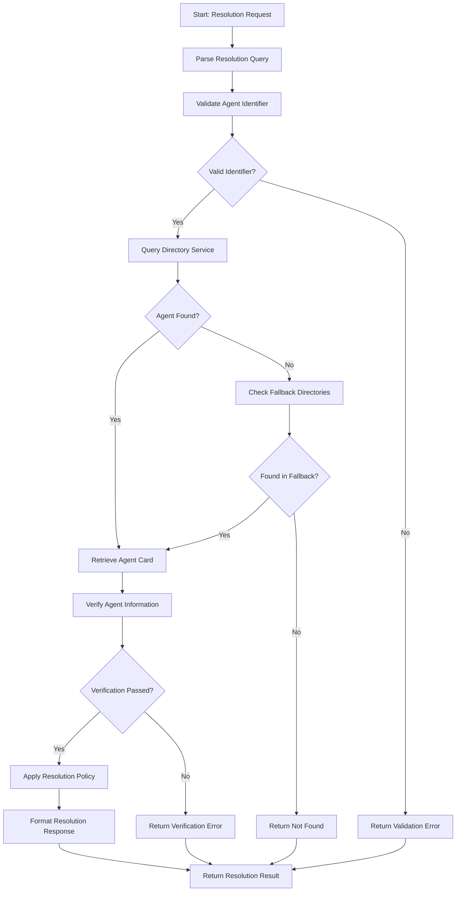

# Agent Resolution Workflow

## Overview

The Agent Resolution Workflow handles the process of locating, verifying, and resolving agent identifiers to their corresponding agent information within the Agent Name Service (ANS). This workflow ensures that applications and services can discover, authenticate, and communicate with the correct agents based on their registered identifiers. The resolution process includes name validation, directory lookup, resolution chain traversal, and comprehensive verification steps to deliver authoritative agent information.

## Workflow Diagram



## Input Schema

The workflow accepts resolution requests with the following information:

```typescript
const agentResolutionSchema = z.object({
  resolutionRequest: z.object({
    identifier: z.string()
      .describe('Agent identifier to resolve, can be a name, alias, or URN'),
    
    identifierType: z.enum(['NAME', 'ALIAS', 'URN', 'AUTO'])
      .default('AUTO')
      .describe('Type of identifier being resolved'),
    
    resolutionOptions: z.object({
      includeMetadata: z.boolean().default(true)
        .describe('Whether to include agent metadata in the response'),
      
      includeCertificate: z.boolean().default(true)
        .describe('Whether to include certificate information in the response'),
      
      verificationLevel: z.enum(['BASIC', 'STANDARD', 'ENHANCED', 'FULL'])
        .default('STANDARD')
        .describe('Level of verification to perform during resolution'),
      
      recursiveResolution: z.boolean().default(true)
        .describe('Whether to follow resolution chains for aliases or redirects'),
      
      maxRecursionDepth: z.number().int().min(1).max(10).default(5)
        .describe('Maximum depth for recursive resolution'),
      
      cacheResults: z.boolean().default(true)
        .describe('Whether to cache resolution results'),
      
      bypassCache: z.boolean().default(false)
        .describe('Whether to bypass cache and force fresh resolution'),
      
      timeout: z.number().int().positive().default(5000)
        .describe('Timeout in milliseconds for the resolution request'),
    }).optional().default({}),
  }),
  
  requestContext: z.object({
    requesterId: z.string().optional()
      .describe('Identifier of the requester if available'),
    
    requesterType: z.enum(['AGENT', 'SERVICE', 'USER', 'SYSTEM']).optional()
      .describe('Type of entity making the request'),
    
    authContext: z.object({
      authMethod: z.enum(['NONE', 'API_KEY', 'CERTIFICATE', 'TOKEN']).optional(),
      authCredential: z.string().optional(),
      authScope: z.string().optional(),
    }).optional(),
    
    sourceIp: z.string().optional()
      .describe('Source IP address of the requester'),
    
    requestTimestamp: z.string().datetime().optional()
      .describe('Timestamp when the request was received'),
    
    correlationId: z.string().uuid().optional()
      .describe('Correlation ID for request tracing'),
    
    requestPriority: z.enum(['LOW', 'NORMAL', 'HIGH', 'CRITICAL']).default('NORMAL')
      .describe('Priority level for this resolution request'),
  }).optional().default({}),
  
  directoryOptions: z.object({
    primaryDirectory: z.string().optional()
      .describe('Primary directory to query (defaults to system default)'),
    
    fallbackDirectories: z.array(z.string()).optional()
      .describe('Fallback directories to query if primary fails'),
    
    directoryParameters: z.record(z.any()).optional()
      .describe('Additional parameters for directory queries'),
    
    enforceTrustedDirectories: z.boolean().default(true)
      .describe('Whether to only use trusted directories'),
    
    crossDirectoryResolution: z.boolean().default(false)
      .describe('Whether to search across directories for resolution'),
  }).optional().default({}),
  
  responseOptions: z.object({
    format: z.enum(['JSON', 'XML', 'CBOR', 'PROTOBUF']).default('JSON')
      .describe('Format of the resolution response'),
    
    includeDebugInfo: z.boolean().default(false)
      .describe('Whether to include debug information in the response'),
    
    compactMode: z.boolean().default(false)
      .describe('Whether to return a compact response format'),
    
    prettyPrint: z.boolean().default(false)
      .describe('Whether to format the response for readability'),
  }).optional().default({})
});
```

## Workflow Steps

### 1. Parse Resolution Query

This step parses and preprocesses the resolution request.

**Input:** Raw resolution request
**Output:**
- Parsed resolution query
- Parameter validation results
- Query metadata
- Any parsing issues

The parsing process:
- Extracts identifier from query
- Determines identifier type if not specified
- Validates request parameters
- Normalizes query parameters
- Sets default parameters
- Sanitizes input values
- Validates format requirements
- Handles character encodings
- Prepares contextual information
- Records parsing metadata

### 2. Validate Agent Identifier

This step validates the agent identifier format and structure.

**Input:** Parsed agent identifier and type
**Output:**
- Validation result
- Normalized identifier
- Format compliance details
- Any validation issues

The validation process:
- Checks identifier syntax
- Validates against format rules
- Normalizes case sensitivity
- Verifies character set
- Validates length constraints
- Checks for reserved prefixes
- Validates namespace format
- Detects invalid patterns
- Normalizes whitespace
- Standardizes identifiers

### 3. Query Directory Service

This step queries the primary directory service for the agent.

**Input:** Validated agent identifier
**Output:**
- Directory query result
- Agent record location
- Directory metadata
- Any query issues

The query process:
- Selects appropriate directory
- Formats query for directory
- Executes directory lookup
- Validates directory response
- Handles directory errors
- Measures query performance
- Implements query timeout
- Records directory metadata
- Applies directory policies
- Checks result completeness

### 4. Check Fallback Directories

This step queries fallback directories if the primary lookup fails.

**Input:** Agent identifier and fallback configuration
**Output:**
- Fallback query results
- Directory traversal details
- Consolidated results
- Any fallback issues

The fallback process:
- Determines fallback sequence
- Queries each fallback directory
- Aggregates directory results
- Validates directory trust
- Handles directory errors
- Manages cross-directory policies
- Records directory metadata
- Applies prioritization rules
- Implements query timeouts
- Preserves query context

### 5. Retrieve Agent Card

This step retrieves the complete agent card information.

**Input:** Directory location information
**Output:**
- Agent card data
- Card metadata
- Card format details
- Any retrieval issues

The retrieval process:
- Fetches complete agent card
- Validates card structure
- Checks card integrity
- Verifies card format
- Handles retrieval errors
- Processes card headers
- Extracts metadata content
- Validates card signatures
- Checks card expiration
- Records retrieval metrics

### 6. Verify Agent Information

This step verifies the integrity and authenticity of the agent information.

**Input:** Agent card and verification level
**Output:**
- Verification result
- Trust assessment
- Verification details
- Any verification issues

The verification process:
- Validates certificate status
- Verifies digital signatures
- Checks trust chains
- Validates timestamps
- Verifies entity attributes
- Checks revocation status
- Validates policy compliance
- Performs integrity checks
- Applies verification level
- Records verification details

### 7. Apply Resolution Policy

This step applies resolution policies based on request context.

**Input:** Verified agent information and request context
**Output:**
- Policy application result
- Filtered information
- Policy decisions
- Any policy issues

The policy application:
- Applies access control policies
- Enforces visibility rules
- Implements privacy restrictions
- Filters metadata based on policies
- Applies capability restrictions
- Enforces relationship rules
- Implements context-based policies
- Applies time-based restrictions
- Records policy decisions
- Validates policy compliance

### 8. Format Resolution Response

This step formats the resolution result according to response options.

**Input:** Agent information and response options
**Output:**
- Formatted resolution response
- Response metadata
- Format details
- Any formatting issues

The formatting process:
- Structures according to format
- Applies format-specific rules
- Implements compaction if requested
- Adds metadata if required
- Formats for readability if requested
- Implements field filtering
- Handles character encoding
- Adds context information
- Applies response transformations
- Validates format compliance

## Error Handling

The workflow handles various error conditions:
- Malformed resolution requests
- Invalid agent identifiers
- Agent not found in directories
- Directory service failures
- Verification failures
- Policy restriction conflicts
- Certificate validation failures
- Response formatting errors
- Timeout conditions
- Recursion depth exceeded

Each error includes:
- Error code
- Description
- Suggested remediation
- Diagnostic information

## Integration Points

The workflow integrates with:
- Input Validation Service for request parsing
- Directory Service for agent lookups
- Certificate Validation Service for verification
- Policy Enforcement Service for resolution policies
- Security Monitoring for access logging
- Caching Service for performance optimization
- Metrics Service for operational monitoring
- Configuration Service for workflow settings
- Audit Service for resolution tracking
- Identity Service for requester context

## Verification Levels

The workflow supports different verification levels based on security requirements:

1. **BASIC** - Minimal verification:
   - Agent existence confirmation
   - Basic card structure validation
   - Format compliance checking
   - Minimal signature verification
   - Surface-level validation
   - Performance optimized
   - Minimal resource usage
   - Fast resolution
   - Limited trust assurance
   - Suitable for non-critical lookups

2. **STANDARD** - Default verification level:
   - Complete signature verification
   - Certificate validation
   - Trust chain verification
   - Timestamp validation
   - Expiration checking
   - Integrity validation
   - Basic revocation checking
   - Standard trust assurance
   - Balanced performance
   - Suitable for most operations

3. **ENHANCED** - Higher security verification:
   - Enhanced certificate validation
   - Full revocation checking
   - Policy compliance validation
   - Extended attribute verification
   - Historical consistency checking
   - Detailed integrity analysis
   - Cross-reference validation
   - Strong trust assurance
   - Moderate performance impact
   - Suitable for sensitive operations

4. **FULL** - Maximum verification:
   - Comprehensive verification
   - Complete trust chain analysis
   - Full certificate verification
   - Cryptographic proof validation
   - Complete revocation checking
   - Historical consistency analysis
   - Directory cross-validation
   - Maximum trust assurance
   - Higher resource usage
   - Suitable for critical operations

## Identifier Types

The workflow handles different types of agent identifiers:

1. **NAME** - Standard agent name:
   - Direct name lookup
   - Exact string matching
   - Case-sensitive comparison
   - Namespace-aware resolution
   - Character set validation
   - Format rule enforcement
   - Reserved name handling
   - Primary identifier type
   - Optimized for direct lookup
   - Standard namespace format

2. **ALIAS** - Alternative agent identifier:
   - Alias resolution to canonical name
   - Redirect processing
   - Ownership verification
   - Alias chain traversal
   - Circular reference detection
   - Alias validity checking
   - Multiple alias support
   - Historical alias tracking
   - Cross-reference validation
   - Namespace boundary handling

3. **URN** - Uniform Resource Name:
   - Structured URN parsing
   - URN scheme validation
   - Namespace identification
   - Component extraction
   - Version handling
   - Parameter processing
   - Hierarchical resolution
   - Cross-boundary resolution
   - Format validation
   - Extended attribute support

4. **AUTO** - Automatic type detection:
   - Format-based type detection
   - Multiple format support
   - Prefix recognition
   - Pattern matching
   - Context-aware detection
   - Fallback handling
   - Format conversion
   - Normalizes before lookup
   - Most flexible option
   - Suitable for general clients

## Usage Examples

```typescript
// Standard name resolution with default options
const standardResolution = await triggerWorkflow('agent-resolution-workflow', {
  resolutionRequest: {
    identifier: 'weather-service-agent',
    identifierType: 'NAME',
    resolutionOptions: {
      includeMetadata: true,
      includeCertificate: true,
      verificationLevel: 'STANDARD'
    }
  }
});

// High-security resolution for a critical service
const secureResolution = await triggerWorkflow('agent-resolution-workflow', {
  resolutionRequest: {
    identifier: 'payment-processor-agent',
    identifierType: 'NAME',
    resolutionOptions: {
      includeMetadata: true,
      includeCertificate: true,
      verificationLevel: 'FULL',
      bypassCache: true,
      timeout: 10000
    }
  },
  requestContext: {
    requesterId: 'security-service',
    requesterType: 'SERVICE',
    authContext: {
      authMethod: 'CERTIFICATE',
      authCredential: 'cert-a1b2c3d4'
    },
    requestPriority: 'HIGH'
  },
  directoryOptions: {
    enforceTrustedDirectories: true
  }
});

// Resolve an agent alias with recursive resolution
const aliasResolution = await triggerWorkflow('agent-resolution-workflow', {
  resolutionRequest: {
    identifier: 'weather-api',
    identifierType: 'ALIAS',
    resolutionOptions: {
      recursiveResolution: true,
      maxRecursionDepth: 3
    }
  }
});

// Cross-directory, auto-detected identifier resolution
const crossDirectoryResolution = await triggerWorkflow('agent-resolution-workflow', {
  resolutionRequest: {
    identifier: 'urn:ans:agent:logging-service:v2',
    identifierType: 'AUTO'
  },
  directoryOptions: {
    fallbackDirectories: ['backup-directory', 'partner-directory'],
    crossDirectoryResolution: true
  },
  responseOptions: {
    format: 'JSON',
    prettyPrint: true,
    includeDebugInfo: true
  }
});
```

## Implementation Notes

- The resolution workflow prioritizes accuracy and security over performance
- Performance optimization uses caching with configurable invalidation rules
- Verification levels allow tuning the security vs. performance balance
- Fallback directories provide resilience against directory failures
- Recursive resolution enables complex alias chains and redirects
- Cross-directory resolution allows lookups across organizational boundaries
- Response formatting supports different integration requirements
- Rate limiting and abuse protection are applied at the workflow level
- Monitoring and metrics help identify resolution patterns and issues
- Policy enforcement ensures appropriate access to agent information

## Response Formats

The workflow supports different response formats based on integration needs:

1. **JSON** - JavaScript Object Notation:
   - Text-based format
   - Human-readable
   - Widely supported
   - Easy integration
   - Schema validation
   - Web-friendly
   - Default format
   - Compact or pretty-printed
   - Streaming support
   - Extended with JSON-LD

2. **XML** - Extensible Markup Language:
   - Structured format
   - Legacy system support
   - Strong schema validation
   - Namespace support
   - Enterprise integration
   - SOAP compatibility
   - XPath query support
   - Digital signature support
   - Transformation capabilities
   - Industry standard support

3. **CBOR** - Concise Binary Object Representation:
   - Binary format
   - Compact representation
   - Efficient parsing
   - Low bandwidth usage
   - IoT optimized
   - Self-describing
   - Schema validation
   - Extended data types
   - Binary efficiency
   - Lower processing overhead

4. **PROTOBUF** - Protocol Buffers:
   - Binary format
   - Schema-driven
   - Highly efficient
   - Strong typing
   - Versioning support
   - Cross-language support
   - Fast serialization
   - Compact representation
   - Forward/backward compatibility
   - RPC system integration

## Resolution Result Schema

The workflow returns a resolution result with the following information:

```typescript
const resolutionResultSchema = z.object({
  status: z.enum(['SUCCESS', 'PARTIAL_SUCCESS', 'NOT_FOUND', 'ERROR']),
  
  statusCode: z.number(),
  
  message: z.string(),
  
  agent: z.object({
    name: z.string()
      .describe('Primary name of the resolved agent'),
    
    aliases: z.array(z.string()).optional()
      .describe('Alternative identifiers for this agent'),
    
    certificate: z.object({
      id: z.string(),
      issuer: z.string(),
      subject: z.string(),
      validFrom: z.string().datetime(),
      validTo: z.string().datetime(),
      status: z.string(),
      publicKey: z.string().optional(),
      fingerprint: z.string()
    }).optional()
      .describe('Agent certificate information'),
    
    metadata: z.record(z.any()).optional()
      .describe('Agent metadata information'),
    
    capabilities: z.array(z.string()).optional()
      .describe('Agent capabilities list'),
    
    endpoints: z.array(z.object({
      type: z.string(),
      url: z.string(),
      protocol: z.string(),
      version: z.string().optional(),
      metadata: z.record(z.any()).optional()
    })).optional()
      .describe('Service endpoints for this agent'),
    
    status: z.string()
      .describe('Current agent status')
  }).optional(),
  
  resolutionDetails: z.object({
    resolutionPath: z.array(z.string()).optional()
      .describe('Path followed for resolution'),
    
    directory: z.string()
      .describe('Directory that provided the result'),
    
    resolutionType: z.enum(['DIRECT', 'ALIAS', 'REDIRECT', 'CROSS_DIRECTORY']),
    
    timestamp: z.string().datetime()
      .describe('When the resolution was performed'),
    
    verificationLevel: z.string()
      .describe('Level of verification performed'),
    
    cacheStatus: z.enum(['FRESH', 'CACHED', 'REVALIDATED', 'EXPIRED']).optional()
      .describe('Cache status of this result'),
    
    ttl: z.number().int().optional()
      .describe('Time to live in seconds for this result'),
    
    policyApplied: z.boolean()
      .describe('Whether resolution policies were applied'),
    
    recursiveResolution: z.boolean()
      .describe('Whether recursive resolution was used'),
    
    recursionDepth: z.number().int().optional()
      .describe('Depth of recursive resolution if used')
  }),
  
  performance: z.object({
    totalTimeMs: z.number()
      .describe('Total resolution time in milliseconds'),
    
    directoryLookupTimeMs: z.number().optional()
      .describe('Time spent on directory lookup'),
    
    verificationTimeMs: z.number().optional()
      .describe('Time spent on verification'),
    
    policyApplicationTimeMs: z.number().optional()
      .describe('Time spent applying policies')
  }).optional(),
  
  error: z.object({
    code: z.string(),
    details: z.string(),
    component: z.string(),
    retryable: z.boolean().optional()
  }).optional()
});
```

## Performance Considerations

- Directory lookup is the most time-consuming operation
- Caching is used to improve resolution performance
- Verification level significantly impacts resolution time
- Certificate validation can be resource-intensive
- Recursive resolution multiplies lookup operations
- Cross-directory resolution increases network overhead
- Response format affects payload size and processing time
- Rate limiting prevents directory service overload
- Connection pooling improves directory query performance
- Batched resolution improves multiple lookup efficiency

## Security Considerations

- All resolution requests are logged for audit purposes
- Requester context affects information visibility
- Verification levels enforce security requirements
- Directory trust boundaries are strictly enforced
- Certificate validation prevents spoofing
- Resolution policies protect sensitive information
- Rate limiting prevents denial of service
- Response format impacts security control effectiveness
- Authorization context determines available information
- Cross-directory resolution requires explicit configuration

## Resolution Policies

The workflow implements various resolution policies:

1. **Access Control**
   - Determines who can resolve which agents
   - Controls attribute visibility
   - Enforces need-to-know principles
   - Implements directory-level restrictions
   - Enforces role-based access
   - Applies attribute-based access control
   - Implements context-aware restrictions
   - Enforces security boundary controls
   - Supports fine-grained permissions
   - Enables delegation controls

2. **Information Visibility**
   - Controls metadata visibility
   - Enforces data classification rules
   - Implements field-level visibility
   - Supports selective disclosure
   - Controls capability visibility
   - Enforces privacy requirements
   - Implements GDPR compliance
   - Controls endpoint visibility
   - Enables dynamic redaction
   - Supports minimized disclosure

3. **Directory Trust**
   - Enforces trusted directory sources
   - Prevents cross-boundary leakage
   - Implements directory validation
   - Controls recursive resolution
   - Enforces directory authentication
   - Validates authoritative sources
   - Prevents directory spoofing
   - Enforces trust chain validation
   - Implements directory ratings
   - Controls fallback behavior

4. **Operational Policy**
   - Enforces rate limiting
   - Implements caching policies
   - Controls resource utilization
   - Enforces timeout policies
   - Implements priority handling
   - Controls batch operations
   - Enforces quota management
   - Implements cost control
   - Supports SLA enforcement
   - Controls failure behavior

## TEST Anchors

- TEST: Successfully parses and validates resolution requests
- TEST: Correctly validates different agent identifier formats
- TEST: Successfully queries primary directory service
- TEST: Properly falls back to secondary directories when needed
- TEST: Accurately retrieves agent card information
- TEST: Correctly verifies agent information at different levels
- TEST: Properly applies resolution policies based on context
- TEST: Formats resolution responses in all supported formats
- TEST: Handles all defined error conditions appropriately
- TEST: Supports all identifier types (NAME, ALIAS, URN, AUTO)
- TEST: Performs recursive resolution with proper depth limiting
- TEST: Correctly implements cross-directory resolution when permitted