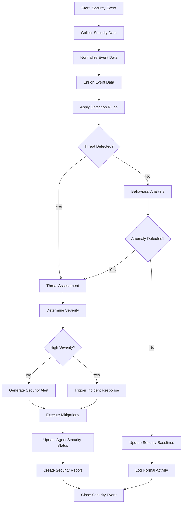

# Security Monitoring Workflow

## Overview

The Security Monitoring Workflow continuously observes the Agent Name Service (ANS) ecosystem to detect, analyze, respond to, and report on security events and anomalies. This workflow includes automatic threat detection, behavioral analysis, anomaly detection, and incident response coordination to maintain the integrity and security of the agent ecosystem. The workflow provides comprehensive monitoring capabilities to identify and mitigate security risks proactively.

## Workflow Diagram



## Input Schema

The workflow processes security events with the following information:

```typescript
const securityEventSchema = z.object({
  eventSource: z.object({
    sourceType: z.enum([
      'AGENT_ACTIVITY', 'CERTIFICATE_OPERATION', 'DIRECTORY_ACCESS', 
      'API_GATEWAY', 'AUTHENTICATION_SERVICE', 'NETWORK_MONITOR',
      'THREAT_INTELLIGENCE', 'SYSTEM_MONITOR', 'AGENT_SELF_REPORT',
      'USER_REPORT', 'AUTOMATED_SCAN'
    ])
      .describe('The type of source that generated this event'),
    
    sourceId: z.string()
      .describe('Identifier for the specific source instance'),
    
    sourceComponentName: z.string().optional()
      .describe('Name of the specific component within the source'),
    
    sourceEnvironment: z.string().optional()
      .describe('Environment where the event originated'),
  }),
  
  eventData: z.object({
    eventType: z.string()
      .describe('The specific type of security event'),
    
    timestamp: z.string().datetime()
      .describe('When the event occurred'),
    
    agentName: z.string().optional()
      .describe('The agent associated with this event, if applicable'),
    
    ipAddress: z.string().optional()
      .describe('IP address related to the event, if applicable'),
    
    userId: z.string().optional()
      .describe('User ID related to the event, if applicable'),
    
    action: z.string().optional()
      .describe('The action that triggered this event'),
    
    outcome: z.enum(['SUCCESS', 'FAILURE', 'BLOCKED', 'UNKNOWN']).optional()
      .describe('The outcome of the action'),
    
    resources: z.array(z.object({
      resourceType: z.string(),
      resourceId: z.string(),
      resourceName: z.string().optional()
    })).optional()
      .describe('Resources involved in the event'),
    
    rawEventData: z.any()
      .describe('Raw data of the security event'),
  }),
  
  contextData: z.object({
    sessionId: z.string().optional()
      .describe('Session identifier if applicable'),
    
    transactionId: z.string().optional()
      .describe('Transaction identifier if applicable'),
    
    requestId: z.string().optional()
      .describe('Request identifier if applicable'),
    
    previousEvents: z.array(z.string()).optional()
      .describe('IDs of related previous events'),
    
    requestMetadata: z.record(z.string()).optional()
      .describe('Additional metadata about the request'),
    
    geoLocation: z.object({
      country: z.string(),
      region: z.string().optional(),
      city: z.string().optional(),
      coordinates: z.tuple([z.number(), z.number()]).optional()
    }).optional()
      .describe('Geographic location related to the event'),
  }).optional(),
  
  metaData: z.object({
    eventId: z.string().uuid()
      .describe('Unique identifier for this security event'),
    
    collectionTimestamp: z.string().datetime()
      .describe('When the event was collected'),
    
    sensorVersion: z.string().optional()
      .describe('Version of the sensor that collected the event'),
    
    schemaVersion: z.string()
      .describe('Version of the event schema'),
    
    confidenceScore: z.number().min(0).max(100).optional()
      .describe('Confidence score for this event (0-100)'),
    
    eventTags: z.array(z.string()).optional()
      .describe('Tags associated with this event'),
  }),
});
```

## Workflow Steps

### 1. Collect Security Data

This step collects security event data from various sources.

**Input:** Raw security events from multiple sensors and sources
**Output:**
- Collected security events
- Collection metadata
- Data quality indicators
- Any collection issues

The collection process:
- Gathers events from security sensors
- Collects logs from system components
- Retrieves data from monitoring agents
- Accepts manual security reports
- Captures network traffic patterns
- Monitors API access patterns
- Processes authentication events
- Records directory access attempts
- Tracks certificate operations
- Monitors agent communications

### 2. Normalize Event Data

This step normalizes collected events into a standard format.

**Input:** Raw security events
**Output:**
- Normalized events
- Format conversion details
- Field mappings
- Any normalization issues

The normalization process:
- Standardizes timestamp formats
- Normalizes field names
- Converts data types
- Applies consistent enumeration values
- Standardizes entity references
- Normalizes address formats
- Aligns event taxonomy
- Handles missing fields
- Validates required fields
- Creates consistent structure

### 3. Enrich Event Data

This step enriches normalized events with additional context.

**Input:** Normalized events
**Output:**
- Enriched events
- Added context information
- Correlation references
- Any enrichment issues

The enrichment process:
- Adds geo-location data
- Resolves IP reputation
- Links to known threat actors
- Attaches organizational context
- Includes asset information
- Adds vulnerability data
- Links to previous events
- Enriches with threat intelligence
- Adds risk context
- Includes behavioral history

### 4. Apply Detection Rules

This step applies security detection rules to identify threats.

**Input:** Enriched events
**Output:**
- Detection results
- Matched rule details
- Detection confidence
- Any detection issues

The detection process:
- Applies signature-based rules
- Matches known attack patterns
- Checks for policy violations
- Applies compliance rules
- Executes detection algorithms
- Monitors for suspicious patterns
- Checks against blocklists
- Applies behavior rules
- Monitors for threshold violations
- Validates access patterns

### 5. Behavioral Analysis

This step analyzes events for anomalous behavior when explicit rules don't match.

**Input:** Events that didn't match explicit rules
**Output:**
- Behavioral analysis results
- Anomaly indicators
- Baseline deviations
- Any analysis issues

The behavioral analysis:
- Compares to established baselines
- Identifies unusual patterns
- Detects abnormal timing
- Identifies irregular access patterns
- Recognizes unusual data flows
- Detects frequency anomalies
- Identifies unusual sequences
- Analyzes volume discrepancies
- Detects pattern breaks
- Identifies entity relationship anomalies

### 6. Update Security Baselines

This step updates security baselines with normal activity data.

**Input:** Events classified as normal activity
**Output:**
- Updated baselines
- Adaptation details
- Learning metrics
- Any update issues

The baseline update process:
- Updates behavioral profiles
- Adjusts normal thresholds
- Updates pattern libraries
- Refines timing expectations
- Adjusts volume expectations
- Updates frequency distributions
- Refines relationship models
- Adapts to seasonal patterns
- Updates normal sequences
- Maintains historical context

### 7. Threat Assessment

This step assesses detected threats or anomalies for impact and severity.

**Input:** Detected threats or anomalies
**Output:**
- Threat assessment
- Risk calculation
- Impact evaluation
- Any assessment issues

The threat assessment:
- Evaluates potential impact
- Assesses scope of effect
- Determines exploitation stage
- Evaluates data sensitivity
- Checks asset criticality
- Assesses potential damage
- Evaluates spread potential
- Determines persistence
- Assesses recovery complexity
- Evaluates business impact

### 8. Determine Severity

This step determines the severity level of the assessed threat.

**Input:** Threat assessment
**Output:**
- Severity rating
- Urgency classification
- Priority assignment
- Any classification issues

The severity determination:
- Applies severity matrix
- Classifies threat level
- Sets response priority
- Determines escalation level
- Applies SLA requirements
- Classifies incident category
- Sets notification levels
- Determines response team
- Establishes time criticality
- Sets resolution expectations

### 9. Generate Security Alert

This step generates alerts for security staff for lower severity issues.

**Input:** Threat details and severity classification
**Output:**
- Security alert
- Notification targets
- Alert metadata
- Any alert generation issues

The alert generation:
- Creates alert content
- Determines alert recipients
- Sets alert priority
- Includes remediation guidance
- Attaches evidence details
- Provides context links
- Sets follow-up requirements
- Formats for delivery channels
- Includes response options
- Creates tracking references

### 10. Trigger Incident Response

This step initiates the incident response process for high severity issues.

**Input:** Threat details and severity classification
**Output:**
- Incident ticket
- Response team activation
- Incident metadata
- Any activation issues

The incident response triggering:
- Creates incident record
- Activates response teams
- Initiates response procedures
- Sets incident priority
- Allocates response resources
- Establishes coordination channels
- Initiates containment actions
- Sets service expectations
- Establishes communication plan
- Creates incident timeline

### 11. Execute Mitigations

This step executes automatic mitigation actions based on the threat.

**Input:** Threat details and response requirements
**Output:**
- Mitigation actions
- Action results
- Mitigation effectiveness
- Any execution issues

The mitigation execution:
- Implements containment measures
- Blocks malicious activity
- Updates security controls
- Adjusts access permissions
- Initiates protective measures
- Applies security patches
- Isolates affected components
- Activates backup systems
- Updates detection rules
- Implements compensating controls

### 12. Update Agent Security Status

This step updates the security status of affected agents.

**Input:** Threat details and affected agents
**Output:**
- Updated security status
- Status change record
- Notification triggers
- Any update issues

The status update process:
- Updates agent security status
- Sets security flags
- Updates risk indicators
- Modifies access permissions
- Updates security metadata
- Sets monitoring requirements
- Updates visibility status
- Modifies capability restrictions
- Sets attestation requirements
- Updates trust indicators

### 13. Create Security Report

This step creates detailed security reports for analysis and record-keeping.

**Input:** Complete event details and response actions
**Output:**
- Security report
- Documentation package
- Analysis summary
- Any reporting issues

The report creation:
- Documents complete event timeline
- Summarizes detection details
- Documents threat assessment
- Records response actions
- Includes evidence artifacts
- Documents mitigation effectiveness
- Creates impact summary
- Includes forensic findings
- Provides recommendation details
- Creates compliance documentation

## Error Handling

The workflow handles various error conditions:
- Data collection failures
- Normalization errors
- Enrichment service failures
- Rule engine failures
- Analysis system errors
- Baseline update failures
- Assessment process errors
- Alert generation failures
- Mitigation execution errors
- Status update failures
- Reporting system errors

Each error includes:
- Error code
- Description
- Recovery actions
- Fallback procedures

## Integration Points

The workflow integrates with:
- Security Information and Event Management (SIEM) system
- Threat Intelligence Platforms
- Intrusion Detection Systems
- Agent Monitoring Services
- Directory Service for access monitoring
- Certificate Operations Monitoring
- API Gateway Security Monitoring
- Network Security Monitoring
- User Behavior Analytics
- Incident Response Management
- Security Orchestration and Automation

## Security Event Sources

The workflow collects data from multiple security event sources:

1. **AGENT_ACTIVITY** - Agent operational events:
   - Agent registration attempts
   - Certificate usage patterns
   - API access patterns
   - Authentication attempts
   - Communication patterns
   - Capability usage
   - Resource utilization
   - Dependency interactions
   - Protocol usage
   - Configuration changes

2. **CERTIFICATE_OPERATION** - Certificate lifecycle events:
   - Certificate issuance
   - Certificate renewal
   - Certificate revocation
   - Validation attempts
   - Trust chain changes
   - Signature operations
   - Key usage patterns
   - Certificate policy applications
   - Certificate exports
   - Certificate extensions

3. **DIRECTORY_ACCESS** - Agent directory access events:
   - Lookup operations
   - Search operations
   - Modification attempts
   - Bulk operations
   - Access control checks
   - Administrative operations
   - Resolution redirects
   - Metadata access
   - Virtual directory operations
   - Cross-namespace operations

4. **API_GATEWAY** - API access security events:
   - Authentication failures
   - Authorization violations
   - Rate limiting triggers
   - Schema validation failures
   - API abuse patterns
   - Malformed requests
   - Service disruption attempts
   - Data leakage attempts
   - Cross-origin violations
   - Protocol violations

5. **AUTHENTICATION_SERVICE** - Authentication system events:
   - Login failures
   - Credential misuse
   - Multi-factor authentication issues
   - Session anomalies
   - Privilege escalation attempts
   - Token misuse
   - Authentication bypass attempts
   - Credential stuffing patterns
   - Password attacks
   - Account recovery abuse

## Usage Examples

```typescript
// Process an authentication failure security event
const authFailureEvent = await triggerWorkflow('security-monitoring-workflow', {
  eventSource: {
    sourceType: 'AUTHENTICATION_SERVICE',
    sourceId: 'auth-service-01',
    sourceComponentName: 'credential-validator',
    sourceEnvironment: 'production'
  },
  eventData: {
    eventType: 'ACCESS.AUTH_FAILURE',
    timestamp: '2023-07-15T14:32:45.123Z',
    agentName: 'payment-processor-agent',
    ipAddress: '203.0.113.42',
    action: 'CERTIFICATE_AUTHENTICATION',
    outcome: 'FAILURE',
    resources: [
      {
        resourceType: 'AGENT_API',
        resourceId: 'api-gateway-3',
        resourceName: 'payment-processor-api'
      }
    ],
    rawEventData: {
      failureReason: 'CERTIFICATE_EXPIRED',
      attemptCount: 3,
      certificateId: 'cert-e5f6g7h8',
      requestPath: '/api/v2/payments/process',
      userAgent: 'JavaAgent/2.1'
    }
  },
  contextData: {
    sessionId: 'sess-a1b2c3d4',
    requestId: 'req-f7g8h9i0',
    geoLocation: {
      country: 'US',
      region: 'California',
      city: 'San Francisco',
      coordinates: [37.7749, -122.4194]
    }
  },
  metaData: {
    eventId: '550e8400-e29b-41d4-a716-446655440000',
    collectionTimestamp: '2023-07-15T14:32:45.500Z',
    sensorVersion: '3.4.2',
    schemaVersion: '1.0',
    confidenceScore: 85,
    eventTags: ['certificate', 'authentication', 'api-gateway']
  }
});

// Process a potential data exfiltration security event
const dataExfiltrationEvent = await triggerWorkflow('security-monitoring-workflow', {
  eventSource: {
    sourceType: 'NETWORK_MONITOR',
    sourceId: 'network-sensor-05',
    sourceComponentName: 'traffic-analyzer',
    sourceEnvironment: 'production'
  },
  eventData: {
    eventType: 'DATA.EXFILTRATION',
    timestamp: '2023-07-15T18:22:13.789Z',
    agentName: 'data-analytics-agent',
    ipAddress: '203.0.113.75',
    action: 'DATA_TRANSFER',
    outcome: 'BLOCKED',
    resources: [
      {
        resourceType: 'DATABASE',
        resourceId: 'customer-db-02',
        resourceName: 'customer-records'
      },
      {
        resourceType: 'NETWORK_ENDPOINT',
        resourceId: 'ext-endpoint-458',
        resourceName: 'unknown-external-endpoint'
      }
    ],
    rawEventData: {
      transferSize: 25600000,
      dataClassification: 'SENSITIVE',
      destinationPort: 8443,
      destinationIp: '198.51.100.23',
      protocolDetails: {
        protocol: 'HTTPS',
        tlsVersion: '1.3',
        serverName: 'data-collection.suspicious-domain.example'
      },
      anomalyFactors: [
        'UNUSUAL_DESTINATION',
        'DATA_VOLUME_SPIKE',
        'OUTSIDE_BUSINESS_HOURS',
        'UNUSUAL_DATA_PATTERN'
      ]
    }
  },
  metaData: {
    eventId: '53de56c8-c2c9-4c6c-8390-143982689e7e',
    collectionTimestamp: '2023-07-15T18:22:14.001Z',
    sensorVersion: '2.8.5',
    schemaVersion: '1.0',
    confidenceScore: 92,
    eventTags: ['data-exfiltration', 'network', 'anomaly', 'sensitive-data']
  }
});
```

## Implementation Notes

- The monitoring workflow operates continuously across the agent ecosystem
- Real-time detection capabilities are prioritized for critical security events
- Machine learning models enhance anomaly detection capabilities
- Detection rules are continuously updated from threat intelligence
- Behavioral baselines adapt to evolving agent usage patterns
- Correlation across event sources improves detection accuracy
- Automated response capabilities reduce time to containment
- Reporting capabilities provide security visibility and trends
- Integration with external security systems enhances monitoring scope
- Performance considerations balance detection capabilities with system impact

## Severity Levels

The workflow categorizes security events into severity levels:

1. **INFORMATIONAL** - Lowest severity:
   - Normal security events
   - System information
   - Regular activities
   - Routine operations
   - Security notices
   - Normal authentication
   - Low-risk activities
   - Baseline operations
   - Standard configurations
   - General information

2. **LOW** - Minor security concerns:
   - Minor policy violations
   - Isolated anomalies
   - Low-risk vulnerabilities
   - Configuration warnings
   - Security advisories
   - Failed authentication attempts
   - Denied access attempts
   - Minor deviations
   - Low-impact issues
   - Configuration drift

3. **MEDIUM** - Moderate security issues:
   - Definite security issues
   - Suspicious behavior
   - Known vulnerabilities
   - Unusual activities
   - Security incidents
   - Persistence attempts
   - System compromises
   - Unauthorized access
   - Resource exhaustion
   - Multiple failed attempts

4. **HIGH** - Serious security concerns:
   - Confirmed attacks
   - Sensitive data access
   - Active exploitation
   - System compromise
   - Unauthorized elevation
   - Malware detection
   - Successful intrusions
   - Critical vulnerabilities
   - Credential compromise
   - Control failures

5. **CRITICAL** - Highest severity:
   - Active data exfiltration
   - Critical system compromise
   - Widespread attack
   - Complete system access
   - Infrastructure takeover
   - Destructive actions
   - Ransomware activity
   - APT detection
   - Multiple system compromise
   - Service disruption

## TEST Anchors

- TEST: Successfully collects security event data from all sources
- TEST: Properly normalizes events with different formats
- TEST: Correctly enriches events with additional context
- TEST: Accurately applies detection rules to identify threats
- TEST: Effectively analyzes behavior for anomaly detection
- TEST: Properly updates security baselines with normal activity
- TEST: Accurately assesses threats for impact and severity
- TEST: Correctly determines severity levels for different threats
- TEST: Successfully generates appropriate security alerts
- TEST: Properly triggers the incident response process for critical issues
- TEST: Effectively executes automatic mitigation actions
- TEST: Correctly updates agent security status
- TEST: Properly creates detailed security reports
- TEST: Handles all defined error conditions appropriately
- TEST: Integrates correctly with all required external systems