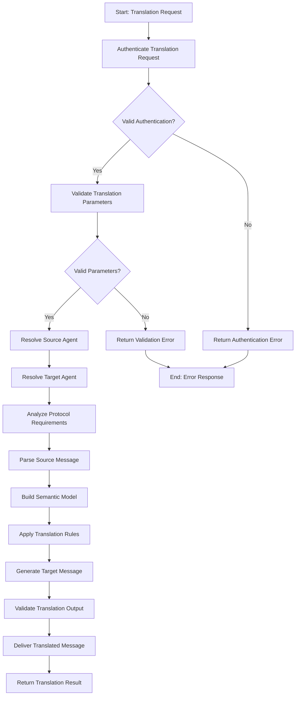

# Protocol Translation Workflow

## Overview

The Protocol Translation Workflow facilitates interoperability between agents using different communication protocols, message formats, and interaction patterns. This workflow enables seamless communication across diverse agent ecosystems by dynamically translating between protocols while preserving semantic meaning, maintaining security context, and ensuring reliable message delivery.

## Workflow Diagram



## Input Schema

The workflow accepts protocol translation requests with the following information:

```typescript
const protocolTranslationSchema = z.object({
  sourceMessage: z.object({
    content: z.string()
      .describe('The message content to translate'),
    
    protocol: z.string()
      .describe('Source protocol identifier'),
    
    format: z.string().optional()
      .describe('Source message format if different from protocol default'),
    
    version: z.string().optional()
      .describe('Protocol version'),
    
    metadata: z.record(z.any()).optional()
      .describe('Additional message metadata')
  }),
  
  sourceAgent: z.object({
    agentIdentifier: z.string()
      .describe('Source agent identifier'),
    
    contextData: z.record(z.any()).optional()
      .describe('Additional context about the source agent')
  }).optional(),
  
  targetAgent: z.object({
    agentIdentifier: z.string()
      .describe('Target agent identifier'),
    
    protocol: z.string()
      .describe('Target protocol identifier'),
    
    format: z.string().optional()
      .describe('Target message format if different from protocol default'),
    
    version: z.string().optional()
      .describe('Protocol version'),
    
    contextData: z.record(z.any()).optional()
      .describe('Additional context about the target agent')
  }),
  
  translationOptions: z.object({
    preserveMode: z.enum(['EXACT', 'SEMANTIC', 'FUNCTIONAL']).default('SEMANTIC')
      .describe('How strictly to preserve the original message meaning'),
    
    includeOriginal: z.boolean().default(false)
      .describe('Whether to include the original message as metadata'),
    
    securityLevel: z.enum(['BASIC', 'STANDARD', 'ENHANCED']).default('STANDARD')
      .describe('Security level for the translation process'),
    
    deliveryMode: z.enum(['SYNCHRONOUS', 'ASYNCHRONOUS', 'STORE_AND_FORWARD']).default('SYNCHRONOUS')
      .describe('How to deliver the translated message'),
    
    translationProfile: z.string().optional()
      .describe('Named translation profile to apply'),
    
    fallbackOptions: z.object({
      enableFallback: z.boolean().default(true)
        .describe('Whether to enable fallback translations'),
      
      fallbackProtocol: z.string().optional()
        .describe('Fallback protocol to use if direct translation fails'),
      
      maxFallbackAttempts: z.number().int().min(0).max(3).default(1)
        .describe('Maximum number of fallback attempts')
    }).optional()
  }).optional(),
  
  translationContext: z.object({
    requesterId: z.string().optional()
      .describe('ID of the requester for authorization checks'),
    
    priority: z.enum(['LOW', 'NORMAL', 'HIGH', 'URGENT']).default('NORMAL')
      .describe('Priority of the translation request'),
    
    timeout: z.number().int().positive().max(60000).default(10000)
      .describe('Timeout for the translation operation in milliseconds'),
    
    idempotencyKey: z.string().optional()
      .describe('Key to ensure idempotent translation operations'),
    
    transactionId: z.string().optional()
      .describe('Transaction ID for tracking related translations')
  }).optional()
});
```

## Workflow Steps

### 1. Authenticate Translation Request

This step authenticates the translation request.

**Input:** Translation request with authentication credentials
**Output:**
- Authentication result
- Authentication method used
- Authentication context
- Any authentication issues

The authentication process:
- Validates authentication credentials
- Verifies requestor identity
- Checks authorization scope
- Validates message signatures
- Verifies source agent identity
- Checks for replay attacks
- Records authentication context

### 2. Validate Translation Parameters

This step validates the translation request parameters.

**Input:** Translation request parameters
**Output:**
- Validation result
- Parameter validation details
- Any validation issues

The validation process:
- Checks parameter presence
- Validates parameter types
- Verifies format requirements
- Checks protocol compatibility
- Validates version compatibility
- Verifies delivery mode support
- Checks content constraints

### 3. Resolve Source Agent

This step resolves the source agent to determine capabilities and context.

**Input:** Source agent identifier
**Output:**
- Resolved source agent information
- Protocol capabilities
- Communication patterns
- Any resolution issues

The resolution process:
- Queries agent registry
- Retrieves agent card
- Extracts protocol capabilities
- Identifies protocol versions
- Determines format support
- Validates security context
- Records source agent metadata

### 4. Resolve Target Agent

This step resolves the target agent to determine capabilities and context.

**Input:** Target agent identifier
**Output:**
- Resolved target agent information
- Protocol capabilities
- Communication patterns
- Any resolution issues

The resolution process:
- Queries agent registry
- Retrieves agent card
- Extracts protocol capabilities
- Identifies protocol versions
- Determines format support
- Validates security context
- Records target agent metadata

### 5. Analyze Protocol Requirements

This step analyzes the requirements for translation between protocols.

**Input:** Source and target protocol information
**Output:**
- Translation requirements
- Protocol mapping details
- Capability assessment
- Any analysis issues

The analysis process:
- Identifies protocol differences
- Determines format transformations
- Maps message patterns
- Analyzes security requirements
- Identifies potential data loss
- Determines semantic preservation approach
- Selects translation strategy

### 6. Parse Source Message

This step parses the source message into a structured representation.

**Input:** Source message and protocol information
**Output:**
- Parsed message structure
- Content components
- Metadata extraction
- Any parsing issues

The parsing process:
- Applies protocol-specific parsers
- Validates message format
- Extracts message components
- Identifies message patterns
- Validates message integrity
- Extracts embedded metadata
- Handles protocol-specific features

### 7. Build Semantic Model

This step builds a protocol-neutral semantic model of the message.

**Input:** Parsed message structure
**Output:**
- Semantic model
- Intent representation
- Content abstraction
- Any model building issues

The model building process:
- Creates abstract representation
- Captures message intent
- Preserves semantic relationships
- Extracts core content
- Maps to canonical model
- Preserves security context
- Records semantic metadata

### 8. Apply Translation Rules

This step applies translation rules to transform between protocols.

**Input:** Semantic model and translation requirements
**Output:**
- Transformation results
- Applied rule details
- Transformation metadata
- Any rule application issues

The rule application includes:
- Selecting applicable rules
- Applying protocol mappings
- Handling format transformations
- Managing protocol-specific features
- Implementing security transformations
- Preserving required metadata
- Recording transformation decisions

### 9. Generate Target Message

This step generates the target message in the required protocol and format.

**Input:** Transformed semantic model and target requirements
**Output:**
- Generated target message
- Format-specific details
- Generation metadata
- Any generation issues

The generation process:
- Applies protocol-specific formatters
- Structures message according to protocol
- Implements format requirements
- Includes required metadata
- Handles protocol-specific features
- Sets security properties
- Finalizes message structure

### 10. Validate Translation Output

This step validates the translated message for correctness and compatibility.

**Input:** Generated target message and validation requirements
**Output:**
- Validation results
- Compliance assessment
- Quality metrics
- Any validation issues

The validation process:
- Checks protocol compliance
- Validates format correctness
- Verifies semantic preservation
- Assesses information loss
- Validates security properties
- Performs structure validation
- Evaluates translation quality

### 11. Deliver Translated Message

This step delivers the translated message to the target agent.

**Input:** Validated target message and delivery options
**Output:**
- Delivery results
- Delivery metrics
- Receipt information
- Any delivery issues

The delivery process:
- Selects delivery mechanism
- Applies delivery mode logic
- Establishes communication channel
- Transmits message payload
- Monitors delivery status
- Handles delivery receipts
- Records delivery metrics

## Error Handling

The workflow handles various error conditions:
- Authentication failures
- Parameter validation issues
- Agent resolution problems
- Protocol incompatibilities
- Parsing errors
- Semantic model failures
- Rule application issues
- Generation failures
- Validation problems
- Delivery failures

## Integration Points

The workflow integrates with:
- Authentication Service for request authentication
- Agent Resolution Service for agent lookup
- Protocol Registry for protocol information
- Translation Rule Engine for transformation rules
- Message Parsing System for parsing operations
- Semantic Modeling Service for abstract representations
- Message Generation Service for target formatting
- Validation Service for output verification
- Delivery Service for message transmission

## Preservation Modes

The workflow supports different preservation modes to balance fidelity with compatibility:

1. **EXACT** - Preserve exact message structure and content:
   - Strictly maintains message structure
   - Preserves all metadata
   - Maintains exact data types
   - May fail if exact preservation impossible
   - Highest fidelity but lowest compatibility
   - Best for critical systems or regulatory requirements

2. **SEMANTIC** - Preserve semantic meaning accurately:
   - Maintains core message intent
   - Preserves essential relationships
   - Allows structural changes
   - Adapts to target protocol capabilities
   - Balance of fidelity and compatibility
   - Default mode for most translations

3. **FUNCTIONAL** - Preserve core functionality only:
   - Focuses on action intent
   - Allows significant reformatting
   - Adaptable to limited protocols
   - Maximizes compatibility
   - Lower fidelity but highest compatibility
   - Suitable for legacy system integration

## Delivery Modes

The workflow supports different delivery modes to handle various operational requirements:

1. **SYNCHRONOUS** - Direct synchronous delivery:
   - Immediate delivery attempt
   - Waits for delivery confirmation
   - Returns delivery status
   - Shortest latency
   - Requires target availability
   - Default mode for normal operations

2. **ASYNCHRONOUS** - Asynchronous delivery:
   - Queues message for delivery
   - Returns acceptance confirmation
   - Delivers as separate operation
   - Moderate latency
   - Handles temporary unavailability
   - Suitable for non-critical messages

3. **STORE_AND_FORWARD** - Guaranteed eventual delivery:
   - Persistently stores message
   - Multiple delivery attempts
   - Handles extended unavailability
   - Higher latency
   - Guaranteed delivery
   - Suitable for critical messages

## Usage Examples

```typescript
// Basic protocol translation
const basicTranslation = await triggerWorkflow('protocol-translation-workflow', {
  sourceMessage: {
    content: '{"weatherRequest": {"location": "New York", "days": 3}}',
    protocol: 'JSON-RPC',
    format: 'json'
  },
  targetAgent: {
    agentIdentifier: 'weather-service-agent',
    protocol: 'REST',
    format: 'json'
  }
});

// Complex translation with enhanced security
const secureTranslation = await triggerWorkflow('protocol-translation-workflow', {
  sourceMessage: {
    content: '<WeatherQuery><Location>London</Location><Days>5</Days></WeatherQuery>',
    protocol: 'SOAP',
    version: '1.2',
    metadata: {
      security: 'signature-required',
      transaction: 'wx-1234'
    }
  },
  sourceAgent: {
    agentIdentifier: 'legacy-weather-client',
    contextData: {
      securityContext: 'enterprise',
      region: 'EMEA'
    }
  },
  targetAgent: {
    agentIdentifier: 'weather-service-agent',
    protocol: 'GraphQL',
    version: '2023-05',
    contextData: {
      endpoint: 'https://weather-api.example.com/graphql',
      apiVersion: 'v2'
    }
  },
  translationOptions: {
    preserveMode: 'SEMANTIC',
    includeOriginal: true,
    securityLevel: 'ENHANCED',
    translationProfile: 'weather-soap-to-graphql',
    fallbackOptions: {
      enableFallback: true,
      fallbackProtocol: 'REST',
      maxFallbackAttempts: 2
    }
  },
  translationContext: {
    priority: 'HIGH',
    timeout: 15000,
    idempotencyKey: 'weather-req-789',
    transactionId: 'user-session-456'
  }
});

// Asynchronous translation for event system
const eventTranslation = await triggerWorkflow('protocol-translation-workflow', {
  sourceMessage: {
    content: 'temperature.changed:device=thermostat1,value=72.5,unit=F,timestamp=1620000000',
    protocol: 'MQTT',
    format: 'csv',
    metadata: {
      topic: 'home/devices/temperature',
      qos: 1
    }
  },
  targetAgent: {
    agentIdentifier: 'home-automation-agent',
    protocol: 'EVENT-STREAM',
    format: 'json'
  },
  translationOptions: {
    deliveryMode: 'ASYNCHRONOUS',
    preserveMode: 'SEMANTIC'
  }
});
```

## Implementation Notes

- The workflow supports a wide range of protocols including REST, GraphQL, SOAP, JSON-RPC, gRPC, MQTT, AMQP, and custom protocols
- Semantic models are essential for accurate cross-protocol translation
- Translation rules are loaded dynamically based on protocol pairs
- Security contexts are maintained throughout the translation process
- Performance optimizations include caching of agent information and translation rules
- Translation profiles provide reusable configurations for common protocol pairs
- The workflow supports protocol-specific features like transactions and idempotency
- Fallback pathways provide resilience when direct translation is not possible

## Translation Profiles

Translation profiles provide pre-configured settings for common protocol translation scenarios:

- Profile Definition: Named set of translation rules and settings
- Rule Precedence: How rules are applied and overridden
- Content Mapping: How message fields are mapped between protocols
- Security Mapping: How security contexts are translated
- Error Handling: Specific error handling for the protocol pair
- Quality Requirements: Minimum quality thresholds for the translation
- Optimization Settings: Performance settings for the translation

## Security Considerations

- The translation workflow maintains message security properties
- Authentication is required for all translation operations
- Security levels dictate the rigor of security validation
- Protocol-specific security features are appropriately translated
- Security downgrade attempts are detected and prevented
- Sensitive data handling follows security requirements
- Audit logs record all translation operations
- Security contexts are preserved throughout translation

## Performance Considerations

- Translation rule caching improves performance for common operations
- Agent information is cached to reduce resolution overhead
- Parsing and generation are optimized for common protocols
- Streaming translation is supported for large messages
- Resource allocation scales with message complexity
- Timeout handling prevents resource exhaustion
- Asynchronous processing improves throughput for bulk translations
- Performance metrics are collected for optimization

## Protocol Capabilities

The workflow maintains awareness of protocol capabilities including:

1. **Communication Patterns** - Request/response, publish/subscribe, streaming
2. **Message Formatting** - Text, binary, structured, unstructured
3. **Type Systems** - Supported data types and type constraints
4. **Security Features** - Authentication, encryption, signing
5. **Transaction Support** - Single, batch, distributed transactions
6. **Delivery Guarantees** - At-most-once, at-least-once, exactly-once
7. **Error Handling** - Error models, status codes, fault tolerances
8. **Extensions** - Protocol-specific extensions and capabilities

## TEST Anchors

- TEST: Successfully authenticates translation requests with valid credentials
- TEST: Correctly validates translation parameters for all protocols
- TEST: Properly resolves source agent information and capabilities
- TEST: Properly resolves target agent information and capabilities
- TEST: Accurately analyzes protocol requirements for translation
- TEST: Successfully parses source messages in all supported formats
- TEST: Correctly builds semantic models preserving message meaning
- TEST: Properly applies translation rules to transform between protocols
- TEST: Accurately generates target messages in required formats
- TEST: Correctly validates translated messages against protocol requirements
- TEST: Successfully delivers messages using all delivery modes
- TEST: Properly preserves message meaning according to preservation mode
- TEST: Correctly handles protocol-specific security features
- TEST: Successfully executes fallback paths when direct translation fails