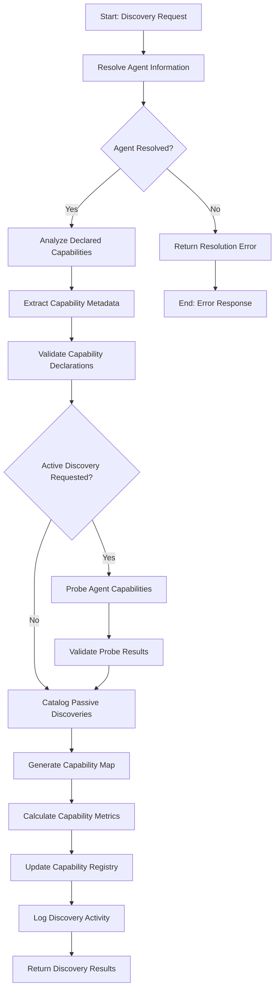

# Agent Capability Discovery Workflow

## Overview

The Agent Capability Discovery Workflow identifies, catalogues, and validates the capabilities provided by agents in the ecosystem. This workflow enables dynamic discovery of agent functionality, allowing for automated integration, interoperability assessment, and capability-based routing and orchestration across the agent ecosystem.

## Workflow Diagram



## Input Schema

The workflow accepts capability discovery requests with the following information:

```typescript
const capabilityDiscoverySchema = z.object({
  agentIdentifier: z.string()
    .describe('The identifier of the agent to discover capabilities for'),
  
  discoveryOptions: z.object({
    discoveryMode: z.enum(['PASSIVE', 'ACTIVE', 'COMPREHENSIVE']).default('PASSIVE')
      .describe('The mode of capability discovery to perform'),
    
    capabilityFilter: z.string().array().optional()
      .describe('Optional filter for specific capability categories'),
    
    includeExamples: z.boolean().default(false)
      .describe('Whether to request example invocations'),
    
    includeSchemas: z.boolean().default(true)
      .describe('Whether to include capability schemas'),
    
    validationLevel: z.enum(['NONE', 'BASIC', 'COMPLETE']).default('BASIC')
      .describe('Level of capability validation to perform'),
    
    probeTimeout: z.number().int().positive().max(30000).default(5000)
      .describe('Timeout for active probing in milliseconds')
  }).optional(),
  
  discoveryContext: z.object({
    requesterId: z.string().optional()
      .describe('ID of the requester for authorization checks'),
    
    purpose: z.enum([
      'INTEGRATION', 'MONITORING', 'CATALOG', 
      'VERIFICATION', 'DEBUGGING', 'ANALYSIS'
    ]).default('INTEGRATION')
      .describe('Purpose of the capability discovery'),
    
    priority: z.enum(['LOW', 'NORMAL', 'HIGH']).default('NORMAL')
      .describe('Priority of the discovery operation')
  }).optional()
});
```

## Workflow Steps

### 1. Resolve Agent Information

This step resolves the agent identifier to retrieve agent information.

**Input:** Agent identifier from discovery request
**Output:**
- Resolved agent information
- Agent metadata
- Resolution status
- Any resolution issues

The resolution process:
- Queries agent registry
- Retrieves agent card
- Validates agent existence
- Assesses agent availability
- Retrieves certificate information
- Retrieves base metadata
- Identifies agent endpoints

### 2. Analyze Declared Capabilities

This step analyzes capabilities explicitly declared by the agent.

**Input:** Resolved agent information
**Output:**
- Declared capabilities list
- Capability categorization
- Declaration metadata
- Any analysis issues

The analysis process:
- Extracts capability declarations
- Parses capability identifiers
- Groups by capability category
- Identifies versioning information
- Detects capability relationships
- Assesses declaration completeness
- Flags potential inconsistencies

### 3. Extract Capability Metadata

This step extracts detailed metadata about declared capabilities.

**Input:** Declared capabilities list
**Output:**
- Capability metadata
- Parameter information
- Schema references
- Any extraction issues

The metadata extraction:
- Parses capability descriptions
- Extracts parameter specifications
- Identifies input/output formats
- Determines authentication requirements
- Records capability constraints
- Extracts documentation references
- Identifies dependency information

### 4. Validate Capability Declarations

This step validates the capability declarations for consistency and correctness.

**Input:** Capability metadata
**Output:**
- Validation results
- Compliance assessment
- Declaration issues
- Any validation errors

The validation process:
- Checks identifier format compliance
- Validates parameter specifications
- Verifies schema references
- Checks for mandatory metadata
- Validates version information
- Assesses documentation completeness
- Identifies inconsistencies

### 5. Probe Agent Capabilities

This step actively probes the agent to discover and verify capabilities.

**Input:** Validated declarations and agent endpoints
**Output:**
- Probe results
- Discovery findings
- Response metrics
- Any probing issues

The probing process:
- Constructs capability probe requests
- Sends discovery queries to agent
- Invokes introspection endpoints
- Tests capability responsive
- Collects capability advertising
- Measures response characteristics
- Records self-description data

### 6. Validate Probe Results

This step validates the results of capability probing.

**Input:** Probe results and declared capabilities
**Output:**
- Validation assessment
- Consistency analysis
- Capability confirmation
- Any validation issues

The validation process:
- Compares probe results with declarations
- Identifies undeclared capabilities
- Detects missing declared capabilities
- Validates parameter conformance
- Assesses response patterns
- Identifies capability variants
- Verifies functional availability

### 7. Catalog Passive Discoveries

This step catalogs capabilities discovered through passive analysis.

**Input:** Validated declarations and probe results
**Output:**
- Cataloged capabilities
- Discovery source attribution
- Confidence metrics
- Any cataloging issues

The cataloging process:
- Combines all discovery sources
- Records capability provenance
- Assigns confidence scores
- Catalogs according to standards
- Maps to capability taxonomy
- Records discovery method
- Maintains discovery history

### 8. Generate Capability Map

This step generates a comprehensive map of agent capabilities.

**Input:** Cataloged capabilities
**Output:**
- Capability map
- Relationship graph
- Dependency information
- Any map generation issues

The map generation:
- Structures capabilities hierarchically
- Maps capability relationships
- Identifies capability dependencies
- Generates capability graph
- Includes version information
- Incorporates metadata
- Structures according to standards

### 9. Calculate Capability Metrics

This step calculates metrics and statistics for the discovered capabilities.

**Input:** Capability map
**Output:**
- Capability metrics
- Coverage assessment
- Completeness indicators
- Any calculation issues

The metrics calculation:
- Assesses capability coverage
- Calculates completeness scores
- Measures documentation quality
- Evaluates schema completeness
- Computes versioning metrics
- Assesses standardization compliance
- Generates capability fingerprint

### 10. Update Capability Registry

This step updates the capability registry with the discovered information.

**Input:** Capability map and metrics
**Output:**
- Registry update confirmation
- Version information
- Update summary
- Any update issues

The registry update:
- Records discovered capabilities
- Updates existing entries
- Manages version history
- Applies registry policies
- Updates search indexes
- Maintains update audit trail
- Handles conflicting information

### 11. Log Discovery Activity

This step logs the discovery activity for audit and operational purposes.

**Input:** Discovery process and results
**Output:**
- Log entry confirmation
- Audit reference information
- Activity metrics
- Any logging issues

The logging captures:
- Agent identifier
- Discovery mode
- Capabilities discovered
- Performance metrics
- Requester information
- Timestamp information
- Discovery outcome

## Error Handling

The workflow handles various error conditions:
- Agent resolution failures
- Declaration parsing issues
- Schema validation errors
- Probe timeouts or failures
- Validation inconsistencies
- Registry update conflicts
- Authorization failures

## Integration Points

The workflow integrates with:
- Agent Resolution Service for agent lookup
- Capability Registry for storage and retrieval
- Capability Taxonomy Service for standardization
- Probing Service for active discovery
- Validation Service for capability verification
- Monitoring Service for operational metrics

## Discovery Modes

The workflow supports different discovery modes to balance thoroughness with performance:

1. **PASSIVE** - Only analyzes declared capabilities without direct interaction:
   - Uses only agent card and registry information
   - No direct agent communication
   - Fast and minimal impact
   - Limited verification
   - Default mode for most operations

2. **ACTIVE** - Performs active probing to verify and discover capabilities:
   - Communicates directly with agent
   - Verifies declared capabilities
   - Discovers undeclared capabilities
   - Assesses actual availability
   - More comprehensive but higher impact

3. **COMPREHENSIVE** - Performs exhaustive discovery and validation:
   - Maximum discovery depth
   - Extensive capability testing
   - Schema validation
   - Example invocation testing
   - Complete metadata gathering
   - Highest impact and longest duration

## Usage Examples

```typescript
// Basic capability discovery using passive mode
const basicDiscovery = await triggerWorkflow('capability-discovery-workflow', {
  agentIdentifier: 'weather-service-agent'
});

// Active discovery with specific capability filtering
const activeFilteredDiscovery = await triggerWorkflow('capability-discovery-workflow', {
  agentIdentifier: 'data-processing-agent',
  discoveryOptions: {
    discoveryMode: 'ACTIVE',
    capabilityFilter: ['data.transform', 'data.analyze'],
    includeExamples: true
  },
  discoveryContext: {
    purpose: 'INTEGRATION'
  }
});

// Comprehensive discovery for catalog purposes
const comprehensiveDiscovery = await triggerWorkflow('capability-discovery-workflow', {
  agentIdentifier: 'multi-function-agent',
  discoveryOptions: {
    discoveryMode: 'COMPREHENSIVE',
    includeSchemas: true,
    includeExamples: true,
    validationLevel: 'COMPLETE',
    probeTimeout: 15000
  },
  discoveryContext: {
    requesterId: 'catalog-service',
    purpose: 'CATALOG',
    priority: 'HIGH'
  }
});
```

## Implementation Notes

- Capability identifiers follow a standardized naming convention:
  - Format: `domain.category.action`
  - Example: `data.transformation.json-to-xml`
- Capability versioning uses semantic versioning (major.minor.patch)
- Capability schemas use JSON Schema or OpenAPI specifications
- Capability relationships include:
  - Dependencies (requires)
  - Alternatives (similar-to)
  - Compositions (composed-of)
  - Extensions (extends)
- Discovery results include confidence scores for each capability
- Active probing respects agent-defined rate limits
- Capability maps are versioned to track evolution
- Discovery history is maintained for trending analysis
- Capabilities may be marked as deprecated or experimental

## Capability Categories

The workflow organizes capabilities into standardized categories:

1. **Data Processing** - Capabilities for transforming, analyzing, and managing data
2. **Communication** - Capabilities for agent-to-agent and agent-to-system communication
3. **Integration** - Capabilities for connecting with external systems and services
4. **Security** - Capabilities related to authentication, authorization, and encryption
5. **Knowledge** - Capabilities for knowledge representation and reasoning
6. **Sensing** - Capabilities for gathering information from environment
7. **Action** - Capabilities for performing actions or generating effects
8. **Coordination** - Capabilities for coordinating multiple agents or processes
9. **Learning** - Capabilities for machine learning and adaptation
10. **Resource** - Capabilities for managing and accessing resources

## TEST Anchors

- TEST: Successfully resolves agent information for valid identifiers
- TEST: Correctly analyzes declared capabilities from agent metadata
- TEST: Properly extracts detailed capability metadata
- TEST: Accurately validates capability declarations against standards
- TEST: Successfully probes agent endpoints in active discovery mode
- TEST: Correctly validates probe results against declarations
- TEST: Properly catalogs passively discovered capabilities
- TEST: Successfully generates structured capability maps
- TEST: Accurately calculates capability metrics and statistics
- TEST: Correctly updates capability registry with discovered information
- TEST: Properly logs discovery activity with complete information
- TEST: Handles error conditions with appropriate error responses
- TEST: Respects discovery options for mode, filtering, and timeout